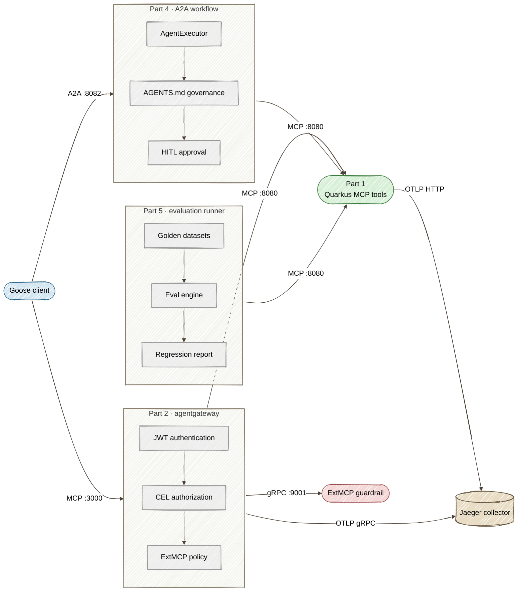

# Building a Governed Enterprise Agent Platform with MCP, A2A, Quarkus, and agentgateway

[](https://danieloh30.github.io/governed-agent-platform/)
[](https://github.com/danieloh30/governed-agent-platform/actions/workflows/tests.yml)
[](https://github.com/danieloh30/governed-agent-platform/security/dependabot)
[](https://github.com/danieloh30/governed-agent-platform/actions/workflows/dependabot-auto-merge.yml)

A five-part Java tutorial for platform engineers covering tool security, observability, human approval, and continuous evaluation. Goose provides the interactive agent client used throughout the labs.

> **📚 Read the complete tutorial at [danieloh30.github.io/governed-agent-platform](https://danieloh30.github.io/governed-agent-platform/)**
>
> Browse the guided learning path, search every chapter, and use the production-readiness reference from the published documentation site.

## The Business Case: Acme FinServ

Every part of this series follows one company so the technology stays tied to a real business problem.

> **Acme FinServ** is a mid-size B2B payments platform: ~200 engineers, ~5,000 enterprise
> customers, **SOC 2 Type II** certified, **PCI-DSS** in scope for its refund and settlement
> flows, and **GDPR**-bound for EU customer data (hence the `EU-WEST-1` region that appears in
> the sample data). The platform team is rolling out the **Goose** AI agent to 50+ engineers
> and wants to expose internal customer-service and operations tooling to AI agents —
> **without losing the audit posture, access controls, and change-management discipline that
> its compliance certifications require.**

That last sentence is the whole series. An AI agent that can call `getAuditTrail`,
`process-refund`, or `deploy-production` is powerful — and, ungoverned, an audit finding
waiting to happen. Each part adds one layer of governance and maps it to the compliance driver
that makes it non-optional:

| Part | Governance layer | Enterprise driver |
|------|------------------|-------------------|
| 1 | Input validation on every tool argument | **PCI/GDPR** input integrity — the boundary that stops malformed or injected PII/card data |
| 2 | JWT auth + RBAC per tool | **SOC 2 CC6** access control — least privilege for *non-human* (agent) identities |
| 3 | End-to-end distributed tracing | **SOC 2 CC7** monitoring — the evidence trail for post-incident forensics |
| 4 | AGENTS.md policy + HITL approval gates | **SOX-style change management** — documented controls on high-risk operations |
| 5 | Golden-dataset regression evaluation | **Continuous control validation** — proof the controls never silently regress |

The personas who show up across the parts: **Maya**, a platform engineer rolling out Goose;
**Sofia**, an SRE who runs `deploy-production`; and **Priya**, an external SOC 2 auditor who
needs read-only access to audit trails and nothing else.

## Tutorial Series

The documentation source lives in [`docs/`](docs/). Start from the **[published site home](https://danieloh30.github.io/governed-agent-platform/)**, follow the **[tutorial learning path](https://danieloh30.github.io/governed-agent-platform/tutorials/)**, or jump to the **[enterprise production-readiness guide](https://danieloh30.github.io/governed-agent-platform/enterprise/production-readiness/)**.

| Part | Title | Directory | What You Build |
|------|-------|-----------|---------------|
| 1 | [Building Governed MCP Tool Services with Quarkus and Goose](docs/tutorials/01-governed-mcp-tools.md) | `part1-quarkus-mcp/` | Quarkus MCP server exposing enterprise tools over Streamable HTTP, connected to Goose AI agent |
| 2 | [Securing and Scaling Goose-to-Java Agent Traffic with agentgateway](docs/tutorials/02-agentgateway-security.md) | `part2-agentgateway/` | agentgateway as a security proxy with JWT auth, RBAC via CEL, and ExtMCP guardrails against tool poisoning |
| 3 | [End-to-End Tracing and Observability](docs/tutorials/03-observability.md) | `part3-observability/` | W3C Trace Context propagation across all layers with Quarkus OpenTelemetry, agentgateway tracing, and Jaeger |
| 4 | [Multi-Agent Orchestration with A2A Protocol](docs/tutorials/04-multi-agent-governance.md) | `part4-multi-agent/` | A2A Java SDK (`@PublicAgentCard` + `AgentExecutor`) with AGENTS.md governance, HITL approval gates, and MCP tool delegation to Part 1 |
| 5 | [Automated Agent Evaluation and Regression Testing](docs/tutorials/05-evaluation.md) | `part5-evaluation/` | Golden datasets, MCP eval runner with accuracy/latency/validation testing, CI/CD integration |

## Architecture



## Prerequisites

- **Java 25+** -- verify with `java -version`
- **Maven 3.9+** -- verify with `mvn --version`
- **Goose CLI** -- install from [block.github.io/goose](https://block.github.io/goose/)
- **agentgateway** (Part 2+) -- `curl -sL https://agentgateway.dev/install | bash`
- **Podman** (Part 3+) -- for running Jaeger via Podman Compose

## Quick Start

Build all modules from the root:

```bash
mvn clean package -DskipTests
```

Each part includes a `start-all.sh` script that launches all required services and an interactive demo SPA:

```bash
# Part 1: Quarkus MCP server + MCP Console SPA
cd part1-quarkus-mcp && ./start-all.sh
# → MCP Console: http://localhost:8887/index.html

# Part 2: agentgateway security proxy + Security Console SPA
cd part2-agentgateway && ./start-all.sh
# → Security Console: http://localhost:8888/index.html

# Part 3: Jaeger tracing + Observability Console SPA
cd part3-observability && ./start-all.sh
# → Observability Console: http://localhost:8890/index.html
# → Jaeger UI: http://localhost:16686

# Part 4: A2A multi-agent + A2A Console SPA
cd part4-multi-agent && ./start-all.sh
# → A2A Console: http://localhost:8889/index.html

# Part 5: Evaluation runner + Evaluation Console SPA
cd part5-evaluation && ./start-all.sh
# → Evaluation Console: http://localhost:8891/index.html
# → Eval API: http://localhost:8083/eval
```

Each demo SPA provides guided steps that walk through the key concepts of that part — no Goose or LLM required.

## Documentation Deployment

The documentation is live at **[danieloh30.github.io/governed-agent-platform](https://danieloh30.github.io/governed-agent-platform/)**. A GitHub Actions workflow builds the Material for MkDocs site from `docs/` and deploys it to GitHub Pages with HTTPS enabled.

The navigation, theme, and extensions are configured in `mkdocs.yml`; custom presentation styles live in `docs/stylesheets/extra.css`.

## Project Structure

```
governed-agent-platform/
├── pom.xml                          # Parent POM (aggregator)
├── docs/                            # GitHub Pages source
│   ├── index.md                     # Documentation landing page
│   ├── tutorials/                   # Ordered five-part learning path
│   └── enterprise/                  # Production-readiness deep dives
├── part1-quarkus-mcp/               # Quarkus MCP server
│   ├── pom.xml
│   ├── src/main/java/               # MCP tools and models
│   ├── src/main/resources/          # Config + server info page
│   ├── index.html                   # MCP Console demo SPA
│   ├── start-all.sh                 # Launches MCP server + demo SPA
│   └── goose-extension-config.yaml
├── part2-agentgateway/              # agentgateway security proxy
│   ├── agentgateway/                # Config files (dev/guardrails/full)
│   ├── extmcp-guardrail/            # Quarkus gRPC guardrail server
│   ├── index.html                   # Interactive security console SPA
│   └── start-all.sh                 # Launches all services
├── part3-observability/             # Distributed tracing
│   ├── agentgateway/                # Config files with tracing enabled
│   ├── compose.yml                  # Jaeger all-in-one
│   └── start-all.sh                 # Launches Jaeger + all services
├── part4-multi-agent/               # A2A multi-agent orchestration
│   ├── pom.xml
│   ├── src/main/java/               # A2A endpoint, workflow engine, governance
│   ├── src/main/resources/AGENTS.md # Governance rules
│   ├── index.html                   # A2A Console SPA
│   └── start-all.sh                 # Launches A2A Flow server
└── part5-evaluation/                # Automated eval and regression testing
    ├── pom.xml
    ├── src/main/java/               # Eval engine, MCP client, REST API
    ├── golden/                      # Golden datasets (JSON)
    │   ├── tool-accuracy.json
    │   ├── validation-boundary.json
    │   └── workflow-regression.json
    ├── index.html                   # Evaluation Console SPA
    └── start-all.sh                 # Launches MCP server + eval runner
```
