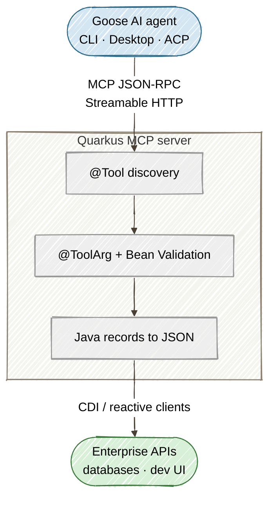

# Part 1: Building Governed MCP Tool Services with Quarkus LangChain4j and Goose

[Tutorial home](index.md) · [Run the example](https://github.com/danieloh30/governed-agent-platform/tree/main/part1-quarkus-mcp) · [Enterprise deep dives](../enterprise/index.md)

> **Lab contract:** You will expose five read-only, in-memory tools and enforce syntactic input constraints at the MCP boundary. Production systems must also authorize the caller, enforce business invariants, isolate tenants, protect downstream credentials, and avoid returning unrestricted customer data. Parts 2–5 add several—but not all—of those controls.

> **TL;DR** — Build governed, cloud-native Java MCP tool services for Goose agents using Quarkus LangChain4j, Java 25, and Jakarta Bean Validation.

> **Enterprise context — Acme FinServ.** Throughout this series we govern the AI-agent
> tooling for *Acme FinServ*, a SOC 2 Type II–certified B2B payments platform that is PCI-DSS
> in scope for its refund flows and GDPR-bound for EU customer data. Maya, a platform engineer,
> is exposing internal customer-service tools to Goose. In this part, the Bean Validation
> constraints (`@Pattern`, `@Size`, `@NotNull`) on each tool argument are not cosmetic — they
> are the **PCI/GDPR input-integrity boundary** that stops a hallucinated or injected customer
> ID from reaching business logic that touches cardholder and PII data. Part 5 later
> regression-tests this exact boundary in CI.

## The Core Problem

Autonomous AI coding agents like Goose go far beyond simple code autocompletion. Built in Rust for speed and portability, Goose runs on your local machine, inspects files, runs terminal commands, and uses tools over the Model Context Protocol (MCP) to automate complex engineering tasks.

But when developers want an AI agent to query enterprise microservices, trigger database migrations, or fetch internal API metrics, the default approach — writing custom local scripts or ad-hoc wrappers — is brittle and dangerous:

- **No input validation.** An LLM might hallucinate a malformed customer ID or inject unexpected characters. Without server-side validation, bad data reaches your business logic unchecked.
- **No standard discovery.** Each tool needs its own documentation and wiring. There is no schema-driven way for Goose to discover what tools exist, what parameters they accept, or what types to expect.
- **No production readiness.** Local scripts don't have health checks, structured logging, or observability. When something fails at 2 AM, there is no telemetry to diagnose it.

The solution is to build a stateless **MCP Tool Server** in Java using Quarkus. Quarkus provides near-zero startup time and low memory footprint, while the `quarkus-mcp-server-http` extension makes exposing `@Tool` methods via standard MCP JSON-RPC trivial. Jakarta Bean Validation hardens every tool invocation with regex patterns, size limits, and nullability constraints — all enforced before your business logic runs.

## Architecture: How Goose Integrates with Quarkus MCP



The flow has three actors:

- **Goose Agent (Client):** Executes on the developer machine, orchestrating LLM tool loops via MCP. Goose discovers tools automatically and decides which to call based on the developer's natural-language prompt.
- **MCP HTTP Transport:** Goose sends structured tool calls to the Quarkus backend as HTTP POST requests using standardized MCP methods (`initialize`, `tools/list`, `tools/call`). The Streamable HTTP transport supports both request-response and server-sent events.
- **Quarkus Microservice:** Validates every parameter with Jakarta Bean Validation, runs the tool logic, and returns Java records that Quarkus serializes to structured JSON for Goose with zero mapping code. (Tools can return a plain type for synchronous work, or a Mutiny `Uni<T>` when a tool needs non-blocking I/O — here the data is in-memory, so we keep the signatures simple.)

## Step 1: Configuring Dependencies in Quarkus

Create a new Quarkus project or update your `pom.xml` to include the MCP server extension and Hibernate Validator:

```xml
<dependencyManagement>
  <dependencies>
    <dependency>
      <groupId>${quarkus.platform.group-id}</groupId>
      <artifactId>${quarkus.platform.artifact-id}</artifactId>
      <version>${quarkus.platform.version}</version>
      <type>pom</type>
      <scope>import</scope>
    </dependency>
  </dependencies>
</dependencyManagement>

<dependencies>
  <dependency>
    <groupId>io.quarkus</groupId>
    <artifactId>quarkus-arc</artifactId>
  </dependency>
  <dependency>
    <groupId>io.quarkus</groupId>
    <artifactId>quarkus-rest-jackson</artifactId>
  </dependency>
  <dependency>
    <groupId>io.quarkiverse.mcp</groupId>
    <artifactId>quarkus-mcp-server-http</artifactId>
    <version>2.0.0.CR2</version>
  </dependency>
  <dependency>
    <groupId>io.quarkus</groupId>
    <artifactId>quarkus-hibernate-validator</artifactId>
  </dependency>
  <dependency>
    <groupId>io.quarkus</groupId>
    <artifactId>quarkus-junit</artifactId>
    <scope>test</scope>
  </dependency>
</dependencies>
```

The key dependency is `quarkus-mcp-server-http` — it provides the Streamable HTTP transport layer that listens on `/mcp` and handles the full MCP JSON-RPC lifecycle (initialize, tools/list, tools/call). The `quarkus-hibernate-validator` dependency enables Jakarta Bean Validation annotations (`@NotNull`, `@Pattern`, `@Size`) on tool parameters.

## Step 2: Implementing Hardened MCP Tools

We will create a `CustomerServiceTools` class that Goose can call when an engineer asks: *"Goose, check the database status for customer CUST-4091 and fetch their recent telemetry."*

By placing `@Tool` annotations on CDI beans, Quarkus automatically registers each method as an MCP tool endpoint. The `@ToolArg` annotation provides parameter descriptions that Goose uses to understand what values to pass:

```java
@ApplicationScoped
public class CustomerServiceTools {

    @Tool(description = "Retrieve the current account status, service tier, "
        + "and primary deployment region for a given customer.")
    public CustomerStatusResponse getCustomerStatus(
            @ToolArg(description = "Customer ID formatted as CUST-XXXX")
            @NotNull
            @Pattern(regexp = "^CUST-[0-9]{4,8}$")
            String customerId) {

        return switch (customerId) {
            case "CUST-4091" -> new CustomerStatusResponse(
                "CUST-4091", "ACTIVE", "ENTERPRISE_TIER", "US-EAST-1");
            case "CUST-2187" -> new CustomerStatusResponse(
                "CUST-2187", "ACTIVE", "BUSINESS_TIER", "EU-WEST-1");
            case "CUST-7734" -> new CustomerStatusResponse(
                "CUST-7734", "SUSPENDED", "STARTER_TIER", "AP-SOUTH-1");
            default -> new CustomerStatusResponse(
                customerId, "NOT_FOUND", "UNKNOWN", "UNKNOWN");
        };
    }

    @Tool(description = "Retrieve recent health-check logs and diagnostic "
        + "metrics for a specified availability zone.")
    public List<String> getZoneHealthLogs(
            @ToolArg(description = "Zone identifier, e.g., US-EAST-1")
            @Size(max = 20)
            String zoneId) {

        return List.of(
            "[" + zoneId + "] CPU utilization: 42% (healthy)",
            "[" + zoneId + "] Memory pressure: 31% (normal)",
            "[" + zoneId + "] Network I/O: 1.2 Gbps ingress / 0.8 Gbps egress",
            "[" + zoneId + "] Disk IOPS: 12,400 read / 8,300 write (within SLA)",
            "[" + zoneId + "] Active connections: 18,230 (capacity: 50,000)",
            "[" + zoneId + "] Last incident: none in past 72 hours"
        );
    }

    @Tool(description = "Track the current status, item count, "
        + "and estimated delivery for an enterprise order.")
    public OrderStatusResponse getOrderStatus(
            @ToolArg(description = "Order ID formatted as ORD-XXXXXXXX")
            @NotNull
            @Pattern(regexp = "^ORD-[0-9]{8}$")
            String orderId) {

        return switch (orderId) {
            case "ORD-20240815" -> new OrderStatusResponse(
                "ORD-20240815", "SHIPPED", 12, "$48,750.00",
                "2024-08-22", "US-EAST-1");
            case "ORD-20240901" -> new OrderStatusResponse(
                "ORD-20240901", "PROCESSING", 5, "$12,300.00",
                "2024-09-10", "EU-WEST-1");
            case "ORD-20241003" -> new OrderStatusResponse(
                "ORD-20241003", "DELIVERED", 28, "$134,500.00",
                "2024-10-08", "AP-SOUTH-1");
            default -> new OrderStatusResponse(
                orderId, "NOT_FOUND", 0, "$0.00", "N/A", "UNKNOWN");
        };
    }

    @Tool(description = "Retrieve SLA compliance metrics including uptime, "
        + "latency, and violation count for a service.")
    public SLAComplianceResponse getSLACompliance(
            @ToolArg(description = "Service identifier, e.g., api-gateway, auth-service")
            @NotNull
            @Size(max = 40)
            String serviceId) {

        return switch (serviceId) {
            case "api-gateway" -> new SLAComplianceResponse(
                "api-gateway", 99.97, "45ms", 99.99, 0, "2024-Q3");
            case "auth-service" -> new SLAComplianceResponse(
                "auth-service", 99.82, "120ms", 99.95, 3, "2024-Q3");
            case "data-pipeline" -> new SLAComplianceResponse(
                "data-pipeline", 98.50, "340ms", 99.80, 12, "2024-Q3");
            case "notification-hub" -> new SLAComplianceResponse(
                "notification-hub", 99.91, "78ms", 99.97, 1, "2024-Q3");
            default -> new SLAComplianceResponse(
                serviceId, 0.0, "N/A", 0.0, -1, "N/A");
        };
    }

    @Tool(description = "Retrieve the security audit trail for a customer, "
        + "showing recent access and configuration events.")
    public List<AuditEvent> getAuditTrail(
            @ToolArg(description = "Customer ID formatted as CUST-XXXX")
            @NotNull
            @Pattern(regexp = "^CUST-[0-9]{4,8}$")
            String customerId) {

        return "CUST-4091".equals(customerId)
            ? List.of(
                new AuditEvent("2024-08-17T09:14:00Z", "admin@acme.com",
                    "LOGIN", "console", "SUCCESS"),
                new AuditEvent("2024-08-17T09:15:30Z", "admin@acme.com",
                    "UPDATE_POLICY", "iam/role-bindings", "SUCCESS"),
                new AuditEvent("2024-08-17T09:22:10Z", "ci-bot@acme.com",
                    "DEPLOY", "us-east-1/prod-cluster", "SUCCESS"),
                new AuditEvent("2024-08-17T10:01:45Z", "ops@acme.com",
                    "SCALE_UP", "us-east-1/worker-pool", "SUCCESS"),
                new AuditEvent("2024-08-17T10:45:00Z", "unknown@external.io",
                    "LOGIN", "console", "DENIED"))
            : List.of(new AuditEvent(
                "N/A", "N/A", "NO_RECORDS", customerId, "NOT_FOUND"));
    }
}
```

Notice the layered validation strategy:

| Annotation | Purpose | Example |
|---|---|---|
| `@NotNull` | Rejects null values before business logic | `customerId` cannot be omitted |
| `@Pattern` | Enforces format with regex | `CUST-4091` passes; `INVALID` is rejected |
| `@Size` | Limits string length | `zoneId` max 20 characters prevents overflow |
| `@ToolArg` | Describes the parameter for LLM agents | Goose reads this to format correct values |

This means an LLM that hallucinates `customerId: "DROP TABLE users"` gets a validation error — not a database query.

## Step 3: Enabling the MCP Extension in application.properties

Configure your Quarkus MCP server settings:

```properties
quarkus.mcp-server.server-info.name=customer-tools
quarkus.mcp-server.server-info.version=1.0.0
quarkus.mcp-server.http.root-path=/mcp

quarkus.log.category."io.quarkiverse.mcp".level=DEBUG
```

The `root-path` setting exposes the MCP endpoint at `http://localhost:8080/mcp`. The server name and version are returned in the `initialize` handshake so clients know what they are connecting to.

Launch Quarkus in dev mode:

```bash
./mvnw quarkus:dev
```

## Step 4: Running the Interactive Demo

The project includes a start script that launches the MCP server and an interactive demo SPA:

```bash
./start-all.sh
```

This will:
1. Build the Quarkus MCP server
2. Start it on `:8080`
3. Launch a demo SPA on `:8887`
4. Verify the MCP session is working

Open `http://localhost:8887/index.html` and walk through the four demo steps:

1. **Initialize** — Establishes an MCP session with the Quarkus server via the `initialize` JSON-RPC handshake. The flow log shows the server name, version, and protocol.
2. **List Tools** — Sends `tools/list` to discover all 5 registered `@Tool` methods with their JSON schemas. The tool inventory panel appears below.
3. **Call Tool** — Select any tool, set parameters, and execute `tools/call`. The architecture diagram animates the request/response flow through the validation layers.
4. **Validation Test** — Sends `getCustomerStatus` with `customerId: "INVALID"` to demonstrate Jakarta Bean Validation rejecting input that does not match `^CUST-[0-9]{4,8}$`.

## Step 5: Connecting Goose to Your Quarkus MCP Server

Goose can be extended with any MCP server over stdio or HTTP. Configure Goose by editing its YAML configuration file or using the Goose CLI.

### Option A: Using the Goose CLI

Register the Quarkus MCP server directly in your terminal:

```bash
goose extension add customer-tools \
  --type http \
  --uri http://localhost:8080/mcp
```

### Option B: Editing ~/.config/goose/config.yaml

Add the Quarkus backend to your Goose extensions configuration:

```yaml
extensions:
  customer-tools:
    enabled: true
    type: http
    uri: http://localhost:8080/mcp
    headers:
      Content-Type: "application/json"
```

## Step 6: Testing the Developer Workflow

Launch Goose via CLI or the Desktop App:

```bash
goose session
```

Prompt Goose:

> **Developer:** *"I'm debugging customer CUST-4091. Use customer-tools to fetch their account tier, and then check the health logs for their primary region."*

### What Happens Under the Hood

1. **Discovery:** Goose sends an HTTP `POST /mcp` JSON-RPC `tools/list` request. Quarkus responds with JSON schema definitions for all five tools — including parameter types, descriptions, and validation constraints.
2. **Tool Invocation 1:** Goose parses the prompt, formats a `tools/call` JSON payload with `{"customerId": "CUST-4091"}`, and posts it to Quarkus.
3. **Execution & Validation:** Quarkus executes Hibernate Bean Validation. Since `CUST-4091` matches `^CUST-[0-9]{4,8}$`, it runs `getCustomerStatus` and returns `primaryRegion: US-EAST-1`.
4. **Tool Invocation 2:** Goose sees `US-EAST-1`, triggers `getZoneHealthLogs("US-EAST-1")`, receives the health metrics, and summarizes the complete diagnostic report back to you in the CLI.

## What We Achieved

| Capability | How |
|---|---|
| **MCP tool discovery** | `@Tool` annotations auto-register methods as MCP endpoints with JSON schemas |
| **Input hardening** | Jakarta Bean Validation (`@Pattern`, `@NotNull`, `@Size`) rejects malformed input before business logic |
| **Zero-config JSON** | Tools return Java records; Quarkus/Jackson serialize them to MCP JSON with no mapping code (return a Mutiny `Uni<T>` only when a tool needs non-blocking I/O) |
| **Streamable HTTP** | `quarkus-mcp-server-http` provides JSON-RPC over HTTP with SSE support |
| **Zero boilerplate** | No hand-written JSON-RPC parsing, schema generation, or HTTP routing |

## Coming Up in Part 2

The MCP server we built gives Goose validated access to enterprise tools — but it is wide open. Any client that can reach `:8080` can call any tool with any arguments. When hundreds of developers run local Goose agents against shared backend microservices, this creates security and governance risks.

**[Part 2: Securing and Scaling Goose-to-Java Agent Traffic with agentgateway](02-agentgateway-security.md)** introduces [agentgateway](https://agentgateway.dev/) — the Linux Foundation data plane proxy — to sit between Goose and Quarkus. We will configure OAuth2/OIDC authentication, fine-grained tool-level RBAC with CEL expressions, and ExtMCP guardrails to harden the enterprise AI infrastructure.
