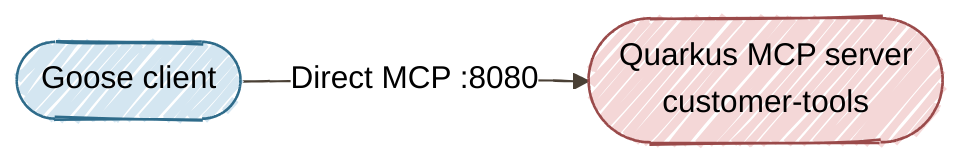
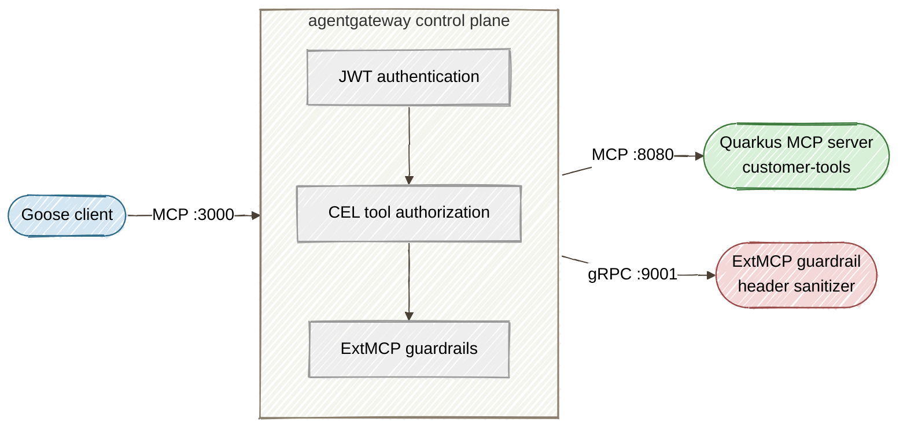

# Part 2: Securing and Scaling Goose-to-Java Agent Traffic With agentgateway

[Tutorial home](../) · [Run the example](../../part2-agentgateway/) · [Enterprise deep dives](../../enterprise/)

> **Lab contract:** You will prove authentication, per-tool authorization, and metadata inspection with local configuration. The sample token and static policy are not production identity. Use an external OIDC issuer, short-lived credentials, strict issuer/audience checks, key rotation, deny-by-default policy, and tenant-aware negative tests in a deployed environment.

**TL;DR:** Deploy agentgateway as a security proxy between Goose AI agents and Quarkus MCP servers to enforce JWT auth, RBAC, and tool-poisoning guardrails.

> **Enterprise context — Acme FinServ.** With 50+ engineers about to run Goose, Acme's security
> team needs to answer a **SOC 2 CC6 (logical access control)** requirement: *least privilege
> for non-human identities*. An AI agent is an identity too, and it must not have blanket access
> to every tool. The RBAC roles in this part map to real people: **Sofia** (SRE, `operator`) can
> call operational tools; a read-only dashboard service (`viewer`) can see status but not audit
> data; and **Priya**, an external SOC 2 auditor (`auditor`), gets `getAuditTrail` and
> `getSLACompliance` — and nothing else. That last mapping is a textbook **segregation-of-duties**
> control an auditor will explicitly look for.

In [Part 1](https://dzone.com/articles/building-governed-mcp-tool-services-with-quarkus-and-goose) of this series, we built a Quarkus-based MCP tool server and connected it to the Goose AI agent over Streamable HTTP. The tools worked, the demo was clean, and everything ran on `localhost`. But the moment you imagine 50 developers running Goose on their laptops, all hitting the same set of backend MCP servers, the architecture starts to crack. Who authenticated that tool call? Which role authorized the `getAuditTrail` invocation? What stops a poisoned tool name from injecting payloads into your backend?

This article answers those questions by placing [agentgateway](https://agentgateway.dev/) — the Linux Foundation's open-source proxy for agentic AI traffic — between Goose clients and the Quarkus MCP microservices we built in Part 1.

## The Problem: Direct Agent-to-Backend Connections Don't Scale

When Goose (or any MCP client) connects directly to a backend MCP server, every tool call is a point-to-point trust relationship:



This works for demos. It breaks in production for three reasons:

1. **No authentication.** The MCP Streamable HTTP endpoint accepts any JSON-RPC call. There is no token verification, no session binding, and no identity propagation.
2. **No authorization.** Every caller can invoke every tool. An intern running Goose has the same access as an SRE — `getAuditTrail`, `getOrderStatus`, everything.
3. **No guardrails.** A compromised or misconfigured agent can send tool names containing prototype-pollution payloads (`__proto__`), path-traversal sequences (`../`), or CRLF-injected headers. The backend has to defend itself alone.

## The Solution: agentgateway as a Unified Control Plane

agentgateway is a Rust-based proxy purpose-built for AI agent traffic. It understands the MCP protocol natively — it doesn't just forward HTTP; it parses JSON-RPC envelopes, manages MCP sessions, and applies policies at the *tool-call* level. Here is the architecture we're building:



Goose connects to agentgateway on port 3000. agentgateway validates the JWT, checks the caller's roles against tool-level RBAC rules, passes the call through an ExtMCP guardrail server that sanitizes headers and blocks poisoning attempts, and only then forwards the clean request to the Quarkus backend on port 8080.

## Prerequisites

You'll need everything from Part 1, plus:

- **agentgateway** binary (v1.4+):

```bash
curl -sL https://agentgateway.dev/install | bash
```

Verify your Part 1 Quarkus MCP server still works:

```bash
cd part1-quarkus-mcp
mvn quarkus:dev
```

Then confirm the MCP endpoint responds:

```bash
curl -s http://localhost:8080/mcp \
  -H "Content-Type: application/json" \
  -H "Accept: application/json, text/event-stream" \
  -d '{"jsonrpc":"2.0","id":1,"method":"initialize","params":{"protocolVersion":"2025-03-26","capabilities":{},"clientInfo":{"name":"curl","version":"1.0"}}}' | jq .
```

## Step 1: Deploy agentgateway Alongside the Quarkus MCP Server

Create the agentgateway configuration at `part2-agentgateway/agentgateway/config-dev.yaml`. This development config proxies MCP traffic without requiring JWT, so you can validate the plumbing first:

```yaml
# yaml-language-server: $schema=https://agentgateway.dev/schema/config
mcp:
  port: 3000
  policies:
    cors:
      allowOrigins:
        - "*"
      allowHeaders:
        - mcp-protocol-version
        - content-type
        - mcp-session-id
      exposeHeaders:
        - Mcp-Session-Id

  targets:
    - name: customer-tools
      mcp:
        host: http://localhost:8080/mcp
```

Start agentgateway:

```bash
agentgateway -f part2-agentgateway/agentgateway/config-dev.yaml
```

Now test the proxied MCP endpoint. Note that agentgateway returns SSE format (`event: message\ndata: {...}`), so we extract the JSON from the `data:` line:

```bash
curl -s http://localhost:3000/mcp \
  -H "Content-Type: application/json" \
  -H "Accept: application/json, text/event-stream" \
  -H "MCP-Protocol-Version: 2025-03-26" \
  -d '{"jsonrpc":"2.0","id":1,"method":"initialize","params":{"protocolVersion":"2025-03-26","capabilities":{},"clientInfo":{"name":"curl","version":"1.0"}}}' \
  | grep '^data: ' | sed 's/^data: //' | jq .
```

You should see the same `customer-tools` server info as Part 1, but the traffic now flows through agentgateway. Open `http://localhost:15000/ui` to see the agentgateway admin UI with your MCP target listed.

## Step 2: Add JWT Authentication

With the proxy working, let's lock it down. The `mcpAuthentication` policy implements the MCP Authorization specification — it validates JWT bearer tokens on every MCP request and supports OAuth 2.1 with PKCE for browser-based flows.

Update the config to `part2-agentgateway/agentgateway/config.yaml`:

```yaml
# yaml-language-server: $schema=https://agentgateway.dev/schema/config
mcp:
  port: 3000
  policies:
    cors:
      allowOrigins:
        - "*"
      allowHeaders:
        - mcp-protocol-version
        - content-type
        - mcp-session-id
        - authorization
      exposeHeaders:
        - Mcp-Session-Id

    mcpAuthentication:
      issuer: http://localhost:9000
      audiences:
        - "http://localhost:3000/mcp"
      jwks:
        url: http://localhost:9000/.well-known/jwks.json
      resourceMetadata:
        resource: http://localhost:3000/mcp
        scopesSupported:
          - "mcp:tools:read"
          - "mcp:tools:execute"
        bearerMethodsSupported:
          - header

  targets:
    - name: customer-tools
      mcp:
        host: http://localhost:8080/mcp
```

### How It Works

When a Goose client (or any MCP client) connects to `http://localhost:3000/mcp`:

1. **Discovery.** The client fetches `/.well-known/oauth-protected-resource` from agentgateway and discovers it needs a bearer token with the `mcp:tools:execute` scope.
2. **Token acquisition.** The client runs the OAuth 2.1 Authorization Code flow with PKCE against the issuer (`http://localhost:9000`), obtains an access token, and includes it as `Authorization: Bearer <token>` on subsequent MCP requests.
3. **Validation.** agentgateway downloads the JWKS from the issuer, verifies the token signature, checks `exp`, `iss`, and `aud` claims, and extracts the `sub` and role claims for downstream authorization.
4. **Forwarding.** Only after validation does agentgateway forward the JSON-RPC call to the Quarkus backend.

### Connecting to a Real OIDC Provider

For production, replace the issuer and JWKS URL with your OIDC provider. Here is an example using Keycloak:

```yaml
    mcpAuthentication:
      issuer: https://keycloak.example.com/realms/mcp
      audiences:
        - "https://gateway.example.com/mcp"
      jwks:
        url: https://keycloak.example.com/realms/mcp/protocol/openid-connect/certs
      provider:
        keycloak: {}
```

agentgateway has built-in support for Keycloak, Auth0, Okta, Microsoft Entra ID, and other OIDC providers.

## Step 3: Configure Tool-Level RBAC With CEL Expressions

JWT authentication tells you *who* is calling. MCP authorization tells you *what* they're allowed to do. agentgateway uses [CEL (Common Expression Language)](https://cel.dev/) to define fine-grained, tool-level RBAC rules.

Add the `mcpAuthorization` policy to your config:

```yaml
    mcpAuthorization:
      rules:
        # Operators can call any tool
        - 'has(jwt.roles) && "operator" in jwt.roles'
        # Viewers can only read status and health
        - >
          has(jwt.roles) && "viewer" in jwt.roles &&
          mcp.tool.name in ["getCustomerStatus", "getZoneHealthLogs", "getSLACompliance"]
        # Auditors can access audit trail and SLA compliance
        - >
          has(jwt.roles) && "auditor" in jwt.roles &&
          mcp.tool.name in ["getAuditTrail", "getSLACompliance"]
```

### How the Rules Work

Each rule is a CEL expression that evaluates to `true` (allow) or `false` (deny). agentgateway evaluates them in order — the first match wins.

| Role | Allowed Tools | Denied Tools |
|------|--------------|--------------|
| `operator` | All five tools | None |
| `viewer` | `getCustomerStatus`, `getZoneHealthLogs`, `getSLACompliance` | `getOrderStatus`, `getAuditTrail` |
| `auditor` | `getAuditTrail`, `getSLACompliance` | `getCustomerStatus`, `getZoneHealthLogs`, `getOrderStatus` |
| No role | None | All |

These aren't abstract labels — at Acme FinServ they map to real people and a real
segregation-of-duties story:

| Persona | Role | Why this scope |
|---------|------|----------------|
| **Sofia** — SRE, on-call for the platform | `operator` | Needs to drive operational tools during incidents; full access is justified and logged. |
| **Acme Status Dashboard** — an internal read-only service | `viewer` | Shows customers and health at a glance; must never read `getOrderStatus` or `getAuditTrail` (PII/financial). |
| **Priya** — *external* SOC 2 auditor | `auditor` | Reviews the audit trail and SLA posture only. Giving her `getCustomerStatus` would *violate* least privilege — an auditor reading live customer data is itself a finding. |

The `auditor` scope is the one a SOC 2 assessor will scrutinize: it proves the audit function
is *separated* from the operational function, and that access is granted by need, not convenience.

agentgateway also auto-filters `tools/list` responses — if a `viewer` calls `tools/list`, they only see the three tools they're authorized to invoke. The agent never even learns that `getAuditTrail` exists.

### Available CEL Variables

| Variable | Description |
|----------|-------------|
| `mcp.tool.name` | The tool being invoked (e.g., `getCustomerStatus`) |
| `mcp.tool.target` | The backend target name (e.g., `customer-tools`) |
| `jwt.sub` | The subject claim from the JWT |
| `jwt.roles` | Role claims extracted from the JWT |
| `has(jwt.<claim>)` | Check whether a JWT claim exists |

## Step 4: Prevent Tool Poisoning With ExtMCP Guardrails

JWT and RBAC protect the *identity* layer. Guardrails protect the *content* layer. A valid, authenticated `operator` can still send a tool call with a poisoned name like `getCustomerStatus/../../../etc/passwd` or arguments containing `<script>` tags. The Quarkus backend's `@Pattern` annotations from Part 1 catch some of this, but defense in depth means filtering at the proxy too.

agentgateway's ExtMCP guardrails intercept MCP method calls *before* they reach the backend, passing them through an external gRPC policy server that can inspect, mutate, or deny each call.

### Building the Guardrail Server With Quarkus gRPC

Instead of relying on a third-party Docker image, we'll build our own ExtMCP guardrail server using Quarkus gRPC — keeping the entire stack in Java. The guardrail server lives in `part2-agentgateway/extmcp-guardrail/` and implements the agentgateway ExtMCP protocol.

First, the protobuf service definition (`src/main/proto/extmcp.proto`):

```protobuf
syntax = "proto3";
package agentgateway.dev.ext_mcp;
option java_package = "com.example.guardrail.grpc";

import "google/protobuf/struct.proto";

service ExtMcp {
  rpc CheckRequest (McpRequest) returns (McpRequestResult);
  rpc CheckResponse (McpResponse) returns (McpResponseResult);
}

message McpRequest {
  repeated string service_names = 1;
  string method = 2;
  google.protobuf.Struct metadata_context = 3;
  optional bytes mcp_request = 4;
  repeated McpHeader headers = 5;
}

message McpRequestResult {
  oneof result {
    Pass pass = 1;
    bytes mutated = 2;
    AuthorizationError error = 3;
  }
  HeaderMutation header_mutation = 4;
}

message AuthorizationError {
  enum Code { UNKNOWN = 0; PERMISSION_DENIED = 1; RESOURCE_EXHAUSTED = 2; INVALID = 3; }
  Code code = 1;
  string reason = 2;
  optional bytes mcp_error = 3;
}
```

The Quarkus service implementation performs header sanitization and tool-poisoning detection:

```java
@GrpcService
public class ExtMcpGuardrailService implements ExtMcp {

    private static final Pattern DANGEROUS_HEADER = Pattern.compile(
            "(?i)^(x-mcp-|x-forwarded-|x-real-ip)");
    private static final List<String> BLOCKED_PATTERNS = List.of(
            "__proto__", "constructor", "../", "eval(", "exec(", "<script");

    @Override
    public Uni<McpRequestResult> checkRequest(McpRequest request) {
        if (!"tools/call".equals(request.getMethod())) {
            return passRequest();
        }
        // 1. Sanitize x-mcp-* headers for CRLF injection
        String headerError = sanitizeHeaders(request.getHeadersList());
        if (headerError != null) {
            return denyRequest("header sanitization failed: " + headerError);
        }
        // 2. Check tool name and arguments for poisoning patterns
        if (request.hasMcpRequest()) {
            String poisonError = checkToolPoisoning(
                    request.getMcpRequest().toStringUtf8());
            if (poisonError != null) {
                return denyRequest("tool poisoning detected: " + poisonError);
            }
        }
        return passRequest();
    }

    @Override
    public Uni<McpResponseResult> checkResponse(McpResponse response) {
        if (!"tools/list".equals(response.getMethod())) {
            return passResponse();
        }
        // Append [guardrail-verified] marker to every tool description
        String original = response.getMcpResponse().toStringUtf8();
        String mutated = original.replace("\"description\":\"",
                "\"description\":\"[guardrail-verified] ");
        return Uni.createFrom().item(McpResponseResult.newBuilder()
                .setMutated(ByteString.copyFrom(mutated, StandardCharsets.UTF_8))
                .build());
    }
}
```

Start the guardrail server on port 9001:

```bash
cd part2-agentgateway/extmcp-guardrail
mvn quarkus:dev
```

### Configuring the Guardrail Policy

Add the `mcpGuardrails` section to the agentgateway config:

```yaml
    mcpGuardrails:
      processors:
        - kind: remote
          host: "localhost:9001"
          failureMode: failClosed
          methods:
            tools/call: request
            tools/list: response
```

The key settings:

| Setting | Value | Why |
|---------|-------|-----|
| `failureMode` | `failClosed` | If the guardrail server is down, deny all tool calls rather than allowing unfiltered traffic |
| `tools/call: request` | Pre-forward | Inspect and sanitize *before* the call reaches the Quarkus backend |
| `tools/list: response` | Post-forward | Annotate or filter the tool list *after* the backend responds |

### How Tool Poisoning Prevention Works

When a `tools/call` request arrives, the guardrail flow is:

```
Goose → agentgateway → [JWT verified] → [RBAC checked] →
  → ExtMCP CheckRequest() → guardrail server inspects:
      1. Scan x-mcp-* headers for CRLF injection
      2. Validate header value lengths (≤ 256 bytes)
      3. Check tool name for blocked patterns (__proto__, ../, eval()...)
      4. Check tool arguments for injection payloads
  → Pass / Mutate / Deny
  → [if passed] → Quarkus MCP backend
```

### Sanitizing x-mcp-header Values

The `x-mcp-*` headers carry protocol metadata between MCP clients and servers. A malicious client can inject CRLF sequences (`\r\n`) into these headers to smuggle additional HTTP headers or split responses. The guardrail server strips these by:

1. Matching any header whose name starts with `x-mcp-`, `x-forwarded-`, or `x-real-ip`
2. Rejecting values that contain `\r` or `\n` characters
3. Enforcing a 256-byte maximum length on these header values

### Building a Custom Guardrail Server

For production, implement the ExtMCP gRPC protocol with two methods:

- **`CheckRequest`** — Called before the tool call reaches the backend. Inspect the tool name, arguments, and headers. Return `Pass`, `Mutate` (rewrite params), or `Deny` with an `AuthorizationError`.
- **`CheckResponse`** — Called after the backend responds. Inspect the result. Return `Pass`, `Mutate` (redact sensitive data), or `Deny`.

The `part2-agentgateway/extmcp-guardrail/` directory contains the complete Quarkus gRPC implementation with the proto definition, the guardrail service, and the Maven build.

### Verifying the Guardrail

With all three services running, test that the guardrail is active:

```bash
# Initialize session
export MCP_SESSION_ID=$(curl -s -D - http://localhost:3000/mcp \
  -H "Content-Type: application/json" \
  -H "Accept: application/json, text/event-stream" \
  -H "MCP-Protocol-Version: 2025-03-26" \
  -d '{"jsonrpc":"2.0","id":1,"method":"initialize","params":{"protocolVersion":"2025-03-26","capabilities":{},"clientInfo":{"name":"curl","version":"1.0"}}}' \
  | grep -i "mcp-session-id:" | sed 's/.*: //' | tr -d '\r')

# Complete handshake
curl -s http://localhost:3000/mcp \
  -H "Content-Type: application/json" \
  -H "Accept: application/json, text/event-stream" \
  -H "MCP-Protocol-Version: 2025-03-26" \
  -H "mcp-session-id: $MCP_SESSION_ID" \
  -d '{"jsonrpc":"2.0","method":"notifications/initialized"}'

# List tools — descriptions should show the guardrail marker
curl -s http://localhost:3000/mcp \
  -H "Content-Type: application/json" \
  -H "Accept: application/json, text/event-stream" \
  -H "MCP-Protocol-Version: 2025-03-26" \
  -H "mcp-session-id: $MCP_SESSION_ID" \
  -d '{"jsonrpc":"2.0","id":2,"method":"tools/list","params":{}}' \
  | grep '^data: ' | sed 's/^data: //' | jq '.result.tools[].description'
```

Each tool description should start with the `[guardrail-verified]` marker, confirming that every `tools/list` response passes through the ExtMCP guardrail before reaching the client.

## Step 5: Configure Goose to Use agentgateway

The final step is the simplest. In Part 1, Goose connected directly to the Quarkus backend:

```yaml
# Part 1 — direct connection
extensions:
  customer-tools:
    enabled: true
    type: http
    uri: http://localhost:8080/mcp
    headers:
      Content-Type: "application/json"
```

For Part 2, change the URI to point at agentgateway:

```yaml
# Part 2 — through agentgateway
extensions:
  customer-tools:
    enabled: true
    type: http
    uri: http://localhost:3000/mcp
    headers:
      Content-Type: "application/json"
```

Copy the updated config:

```bash
cp part2-agentgateway/goose-extension-config.yaml ~/.config/goose/config.yaml
```

Now launch Goose and test the same prompts from Part 1:

```
Check customer status for CUST-4091 and verify health logs for their region
```

The response is identical to Part 1, but the traffic now flows through agentgateway with JWT validation, RBAC enforcement, and guardrail inspection. You can verify this by checking the agentgateway UI at `http://localhost:15000/ui` — every tool call appears in the request log with its authentication status and policy decisions.

## The Complete Configuration

Here is the full `config.yaml` combining all four security layers:

```yaml
# yaml-language-server: $schema=https://agentgateway.dev/schema/config
config:
  tracing:
    endpoint: http://localhost:4317
    protocol: grpc
    sampling:
      parent: true
      default: 1.0

mcp:
  port: 3000
  policies:
    cors:
      allowOrigins:
        - "*"
      allowHeaders:
        - mcp-protocol-version
        - content-type
        - mcp-session-id
        - authorization
      exposeHeaders:
        - Mcp-Session-Id

    mcpAuthentication:
      issuer: http://localhost:9000
      audiences:
        - "http://localhost:3000/mcp"
      jwks:
        url: http://localhost:9000/.well-known/jwks.json
      resourceMetadata:
        resource: http://localhost:3000/mcp
        scopesSupported:
          - "mcp:tools:read"
          - "mcp:tools:execute"
        bearerMethodsSupported:
          - header

    mcpAuthorization:
      rules:
        - 'has(jwt.roles) && "operator" in jwt.roles'
        - >
          has(jwt.roles) && "viewer" in jwt.roles &&
          mcp.tool.name in ["getCustomerStatus", "getZoneHealthLogs", "getSLACompliance"]
        - >
          has(jwt.roles) && "auditor" in jwt.roles &&
          mcp.tool.name in ["getAuditTrail", "getSLACompliance"]

    mcpGuardrails:
      processors:
        - kind: remote
          host: "localhost:9001"
          failureMode: failClosed
          methods:
            tools/call: request
            tools/list: response

  targets:
    - name: customer-tools
      mcp:
        host: http://localhost:8080/mcp
```

## Bonus: Interactive Security Console

The demo includes a browser-based SPA (`index.html`) that lets you visualize the entire security flow without touching the command line. The `start-all.sh` script serves it automatically on port 8888.

Open `http://localhost:8888/index.html` and you'll see an enterprise-style console with:

- **Config selector** — switch between three tiered configs to see how each maps to a real deployment stage:
- **Live stat tiles** — session status, request count, tools discovered, and security checks passed/denied
- **Animated architecture diagram** — watch MCP requests flow from Goose through agentgateway's security layers to the Quarkus backend in real time
- **Config-aware security layers** — JWT, RBAC, and ExtMCP layers animate as "checking → passed" when enabled in the selected config, or appear as "skipped" with a badge when not configured

| Config | Use Case | Security Layers |
|--------|----------|-----------------|
| `config-dev.yaml` | **Local development** — pure proxy pass-through for rapid iteration without security overhead | None |
| `config-guardrails.yaml` | **Staging / shared environments** — blocks tool poisoning and header injection before requests reach the backend | ExtMCP |
| `config.yaml` | **Production deployment** — full security stack with JWT identity verification, role-based tool access via CEL, and input sanitization | JWT + RBAC + ExtMCP |

The four demo steps — Initialize, List Tools, Call Tool, and Poison Test — make real MCP requests through agentgateway and display the JSON-RPC responses. Switching configs lets you demonstrate the difference: with `config-dev.yaml`, the poison test passes through unblocked; with `config-guardrails.yaml`, the ExtMCP guardrail catches and denies it; with `config.yaml`, every request also passes through JWT authentication and RBAC authorization before reaching the guardrail layer.

## What We Achieved

Starting from the unprotected Quarkus MCP server in Part 1, we added four security layers without changing a single line of the backend Java code:

| Layer | What It Does | agentgateway Feature |
|-------|-------------|---------------------|
| **Authentication** | Verifies caller identity via JWT/OAuth 2.1 with PKCE | `mcpAuthentication` |
| **Authorization** | Enforces tool-level RBAC per role | `mcpAuthorization` with CEL |
| **Input sanitization** | Blocks tool poisoning and header injection | `mcpGuardrails` (ExtMCP) |
| **Observability** | Traces every tool call through the proxy | OpenTelemetry integration |

The Quarkus MCP backend remains a clean, focused tool server. All governance concerns live in the agentgateway configuration and the Quarkus gRPC guardrail service — keeping the entire stack in Java, exactly where platform engineers expect to find them.

## What's Next: Part 3

In **Part 3: End-to-End Tracing and Observability Across Goose, agentgateway, and Quarkus**, we'll wire up distributed tracing across the full agent traffic path. You'll see how a single Goose prompt generates a trace that spans the agent, the gateway, and the Quarkus backend — with tool-call latency, RBAC decisions, and guardrail verdicts all visible in a single Jaeger or Grafana Tempo timeline. We'll configure OpenTelemetry exporters in all three components and build a Grafana dashboard that gives platform teams real-time visibility into their agentic infrastructure.

Stay tuned.
