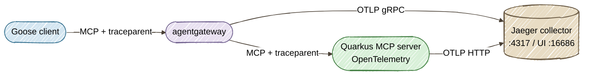

# Part 3: End-to-End Tracing and Observability Across Goose, agentgateway, and Quarkus

[Tutorial home](../) · [Run the example](../../part3-observability/) · [Enterprise deep dives](../../enterprise/)

> **Lab contract:** You will correlate MCP calls in a local Jaeger instance. Before production, define an attribute allowlist, redact PII and secrets, choose head or tail sampling by risk, secure the collector, set retention by data class, and alert from service-level signals—not from traces alone.

> **TL;DR** — Add W3C Trace Context propagation across Goose, agentgateway, and Quarkus to turn opaque agentic tool loops into fully observable distributed traces in Jaeger.

> **Enterprise context — Acme FinServ.** **SOC 2 CC7 (system monitoring)** requires that Acme
> can detect and *investigate* anomalous activity. When an agent-driven workflow touches customer
> data at 2 AM, "we have logs somewhere" is not an answer an auditor accepts. The distributed
> trace built in this part is the **forensic evidence trail**: a single trace ID that ties the
> Goose prompt to every agentgateway policy decision and every Quarkus tool call, so a post-incident
> review can reconstruct exactly which agent did what, in what order, and how long each governed
> hop took.

## The Core Problem

In [Part 1](../01-governed-mcp-tools/) we built a Quarkus MCP tool server. In [Part 2](../02-agentgateway-security/) we secured it with agentgateway's JWT authentication, RBAC, and ExtMCP guardrails. The architecture works — but when something goes wrong in production, you're flying blind.

Agentic workflows are fundamentally different from traditional request-response APIs. A single user prompt like *"Debug customer CUST-4091"* triggers a multi-round-trip loop:

1. Goose calls `tools/list` to discover available tools
2. The LLM selects `getCustomerStatus` and Goose sends `tools/call`
3. The LLM reads the response, sees `primaryRegion: US-EAST-1`, and chains a second `tools/call` to `getZoneHealthLogs`
4. The LLM correlates both results and generates a diagnostic summary

Each of these hops crosses process boundaries: Goose → agentgateway → Quarkus. Without distributed tracing, you see four isolated HTTP requests in your access logs. You cannot tell they belong to the same agentic workflow. When step 3 takes 12 seconds instead of 200ms, you have no waterfall to pinpoint whether the latency came from agentgateway policy evaluation, Quarkus bean validation, or a slow downstream call.

This creates **black holes in telemetry dashboards** — the exact gap that autonomous agents exploit to degrade silently.

## The Solution: W3C Trace Context Across All Three Layers

The fix is standard distributed tracing, applied to the MCP transport layer:



- **agentgateway** exports spans for every proxied MCP request and propagates `traceparent` headers to the backend.
- **Quarkus** with `quarkus-opentelemetry` picks up the incoming `traceparent`, creates child spans for tool execution and bean validation, and exports them to the same Jaeger instance.
- **Jaeger** correlates both sides into a single trace waterfall — one view from agent prompt to tool result.

## Prerequisites

Everything from Parts 1 and 2, plus:

- **Podman** — for running Jaeger (`podman compose`)

Verify Podman is available:

```bash
podman --version
```

## Step 1: Launching the Observability Backend

We use Jaeger v2 as both the OTLP collector and the trace UI. A single container accepts traces from agentgateway on port 4317 (OTLP gRPC) and from Quarkus on port 4318 (OTLP HTTP), and serves the query UI on port 16686.

```bash
cd part3-observability
podman compose up -d
```

This starts Jaeger v2 with OTLP collection enabled by default. Verify it's running:

```bash
curl -sf http://localhost:16686/ > /dev/null && echo "Jaeger UI is ready"
```

Open [http://localhost:16686](http://localhost:16686) — you'll see an empty Jaeger UI. We'll populate it with MCP traces in the following steps.

### Production Alternative: Grafana Tempo

For production deployments, replace Jaeger with [Grafana Tempo](https://grafana.com/oss/tempo/) backed by object storage (S3/GCS). The OTLP endpoint stays the same — only the `compose.yml` changes. Grafana provides richer dashboards, alerting, and long-term trace retention.

## Step 2: Enabling OpenTelemetry in Quarkus

Add the `quarkus-opentelemetry` extension to Part 1's `pom.xml`:

```xml
<dependency>
  <groupId>io.quarkus</groupId>
  <artifactId>quarkus-opentelemetry</artifactId>
</dependency>
```

Configure the exporter in `application.properties`:

```properties
# OpenTelemetry
quarkus.otel.service.name=customer-tools
quarkus.otel.exporter.otlp.traces.endpoint=http://localhost:4318
quarkus.otel.exporter.otlp.traces.protocol=http/protobuf
quarkus.otel.traces.sampler=always_on
quarkus.otel.traces.suppress-non-application-uris=false
```

| Property | Purpose |
|----------|---------|
| `service.name` | Identifies this service in Jaeger's service dropdown |
| `traces.endpoint` | OTLP HTTP receiver — Jaeger's port 4318 (base URL only; Quarkus appends `/v1/traces`) |
| `traces.protocol` | `http/protobuf` — Quarkus uses its Vert.x-based HTTP exporter |
| `traces.sampler` | `always_on` — sample every span (reduce in production) |
| `suppress-non-application-uris` | `false` — include MCP endpoint spans (they'd be filtered otherwise) |

When no OTLP collector is running (Parts 1 and 2 without Jaeger), Quarkus logs a connection warning but the MCP server works normally. When the collector IS running (Part 3), traces flow automatically. Zero code changes to the MCP tools.

Rebuild Part 1:

```bash
cd part1-quarkus-mcp
mvn package -DskipTests
```

### What Quarkus Auto-Instruments

With `quarkus-opentelemetry` on the classpath and the SDK enabled, Quarkus automatically creates spans for:

| Layer | Span Name | What It Captures |
|-------|-----------|-----------------|
| HTTP server | `POST /mcp` | Inbound MCP request with method, status, latency |
| CDI beans | `CustomerServiceTools.getCustomerStatus` | Tool execution time within the MCP handler |
| Bean Validation | `HibernateValidator` | Parameter validation before tool logic runs |
| REST client | Outbound HTTP calls | Any downstream API calls (future extensions) |

No `@WithSpan` annotations needed. The Quarkus OpenTelemetry extension instruments the reactive pipeline automatically.

## Step 3: Configuring W3C Trace Context in agentgateway

agentgateway supports native OpenTelemetry trace export. Add a `tracing` block to the gateway configuration:

```yaml
config:
  adminAddr: localhost:15000
  tracing:
    otlpEndpoint: http://localhost:4317
    otlpProtocol: grpc
    randomSampling: 1.0
```

| Field | Purpose |
|-------|---------|
| `otlpEndpoint` | OTLP receiver — Jaeger's port 4317 |
| `otlpProtocol` | `grpc` for OTLP/gRPC (also supports `http`) |
| `randomSampling` | Sample 100% of traces (reduce to 0.01–0.1 in production) |

### How Trace Propagation Works

When agentgateway receives an MCP request:

1. **Creates a root span** for the proxy operation (e.g., `agentgateway.mcp.proxy`)
2. **Injects a `traceparent` header** into the forwarded request to Quarkus:
   ```
   traceparent: 00-4bf92f3577b34da6a3ce929d0e0e4736-00f067aa0ba902b7-01
   ```
3. **Quarkus reads the `traceparent`**, creates a child span under the same trace ID, and records tool execution
4. **Both spans export to Jaeger** via OTLP, where they appear as a single correlated trace

This is standard [W3C Trace Context](https://www.w3.org/TR/trace-context/) propagation — the same mechanism used across all OpenTelemetry-instrumented services.

### Configuration Files

Part 3 provides two agentgateway configurations:

| Config | Use Case |
|--------|----------|
| `config-traced.yaml` | Tracing only — proxy + OTLP export, no security layers |
| `config-traced-guardrails.yaml` | Tracing + ExtMCP guardrails — observe the guardrail evaluation spans too |

## Step 4: Running the Interactive Demo

Start all services with the one-command script:

```bash
cd part3-observability
./start-all.sh
```

The script starts Jaeger, Quarkus (with OTel enabled), and agentgateway (with trace export), then launches the demo SPA on `:8890`.

Open the **MCP Observability Console** at [http://localhost:8890/index.html](http://localhost:8890/index.html) and walk through the three demo steps:

1. **Initialize** — Establishes an MCP session through agentgateway. The architecture diagram animates the trace propagation: root span creation in agentgateway, `traceparent` injection, child span in Quarkus, and OTLP export to Jaeger.
2. **List Tools** — Discovers all 5 tools through the traced proxy. The trace waterfall panel shows the agentgateway proxy span and the Quarkus HTTP span side by side with timing.
3. **Multi-Tool Workflow** — Simulates Goose's multi-turn reasoning: `getCustomerStatus` (finds region US-EAST-1) → `getZoneHealthLogs` (checks zone health) → `getSLACompliance` (correlates SLA metrics). Each step generates a full trace with waterfall visualization.

The stat tiles track traces generated, spans collected, and Jaeger status. Click **Open Jaeger** to view the real trace waterfalls in the Jaeger UI at `http://localhost:16686`.

## Step 5: Generating Traces via CLI

To generate additional traces manually, simulate a multi-turn agentic workflow:

```bash
# Step 1: Initialize MCP session
export MCP_SESSION_ID=$(curl -s -D - http://localhost:3000/mcp \
  -H "Content-Type: application/json" \
  -H "Accept: application/json, text/event-stream" \
  -H "MCP-Protocol-Version: 2025-03-26" \
  -d '{"jsonrpc":"2.0","id":1,"method":"initialize","params":{"protocolVersion":"2025-03-26","capabilities":{},"clientInfo":{"name":"curl","version":"1.0"}}}' \
  | grep -i "mcp-session-id:" | sed 's/.*: //' | tr -d '\r')

# Step 2: Discover tools
curl -s http://localhost:3000/mcp \
  -H "Content-Type: application/json" \
  -H "Accept: application/json, text/event-stream" \
  -H "MCP-Protocol-Version: 2025-03-26" \
  -H "mcp-session-id: $MCP_SESSION_ID" \
  -d '{"jsonrpc":"2.0","id":2,"method":"tools/list","params":{}}' \
  | grep '^data: ' | sed 's/^data: //' | jq .

# Step 3: Agent calls getCustomerStatus (first tool invocation)
curl -s http://localhost:3000/mcp \
  -H "Content-Type: application/json" \
  -H "Accept: application/json, text/event-stream" \
  -H "MCP-Protocol-Version: 2025-03-26" \
  -H "mcp-session-id: $MCP_SESSION_ID" \
  -d '{"jsonrpc":"2.0","id":3,"method":"tools/call","params":{"name":"getCustomerStatus","arguments":{"customerId":"CUST-4091"}}}' \
  | grep '^data: ' | sed 's/^data: //' | jq .

# Step 4: Agent chains getZoneHealthLogs based on the region from step 3
curl -s http://localhost:3000/mcp \
  -H "Content-Type: application/json" \
  -H "Accept: application/json, text/event-stream" \
  -H "MCP-Protocol-Version: 2025-03-26" \
  -H "mcp-session-id: $MCP_SESSION_ID" \
  -d '{"jsonrpc":"2.0","id":4,"method":"tools/call","params":{"name":"getZoneHealthLogs","arguments":{"zoneId":"US-EAST-1"}}}' \
  | grep '^data: ' | sed 's/^data: //' | jq .

# Step 5: Agent fetches SLA compliance for correlation
curl -s http://localhost:3000/mcp \
  -H "Content-Type: application/json" \
  -H "Accept: application/json, text/event-stream" \
  -H "MCP-Protocol-Version: 2025-03-26" \
  -H "mcp-session-id: $MCP_SESSION_ID" \
  -d '{"jsonrpc":"2.0","id":5,"method":"tools/call","params":{"name":"getSLACompliance","arguments":{"serviceId":"api-gateway"}}}' \
  | grep '^data: ' | sed 's/^data: //' | jq .
```

Each of these requests generates a trace that flows through agentgateway into Quarkus and lands in Jaeger.

## Step 6: Visualizing the Trace Waterfall in Jaeger

Open [http://localhost:16686](http://localhost:16686) in your browser.

### Finding Traces

1. In the **Service** dropdown, select `customer-tools` (Quarkus) or `agentgateway`
2. Click **Find Traces**
3. Click on any trace to open the waterfall view

### Reading the Waterfall

A typical `tools/call` trace shows the following span hierarchy:

```
agentgateway.mcp.proxy                        [12ms]
  └─ POST /mcp                                [8ms]  ← Quarkus HTTP server
       └─ CustomerServiceTools.getCustomerStatus [2ms]  ← CDI tool execution
```

| Span | Service | What It Tells You |
|------|---------|-------------------|
| `agentgateway.mcp.proxy` | agentgateway | Total proxy overhead including policy evaluation |
| `POST /mcp` | customer-tools | Quarkus HTTP handling time for the MCP request |
| `getCustomerStatus` | customer-tools | Pure tool execution time (business logic) |

### What to Look For

- **Proxy overhead**: The gap between the agentgateway span and the Quarkus span shows network + policy evaluation time. If this grows, check guardrail server latency.
- **Validation time**: Bean Validation spans appear before tool execution. Regex-heavy patterns like `^CUST-[0-9]{4,8}$` are fast, but complex validators on large payloads can add latency.
- **Multi-turn correlation**: When Goose chains multiple tool calls (e.g., `getCustomerStatus` → `getZoneHealthLogs`), each appears as a separate trace. The `mcp-session-id` tag lets you filter all traces belonging to one agent session.
- **Error traces**: Failed validations (invalid customer ID format) or guardrail rejections (blocked poison payloads) produce error spans with exception details.

### Connecting Goose for Real Traces

Launch Goose pointed at agentgateway and prompt a multi-tool workflow:

```bash
goose session
```

> *"Debug customer CUST-4091 — check their account status, then pull health logs for their region and SLA compliance for api-gateway."*

This generates a burst of correlated traces in Jaeger showing Goose's multi-turn tool orchestration from the proxy layer down to individual tool execution spans.

## What We Achieved

Starting from the secured architecture in Part 2, we added full observability without changing any MCP tool code:

| Layer | What We Added | Config Change |
|-------|--------------|---------------|
| Quarkus | `quarkus-opentelemetry` dependency | `pom.xml` + `application.properties` |
| agentgateway | `tracing` block in config YAML | `config-traced.yaml` |
| Observability backend | Jaeger all-in-one via Podman Compose | `compose.yml` |

The entire stack runs locally with a single `./start-all.sh` command and produces end-to-end trace waterfalls in Jaeger.

### Production Considerations

| Concern | Local (this tutorial) | Production |
|---------|----------------------|------------|
| Trace backend | Jaeger all-in-one (in-memory) | Grafana Tempo + object storage |
| Sampling rate | 100% (`default: 1.0`) | 1-10% or adaptive sampling |
| Trace retention | Container lifetime | Days/weeks in durable storage |
| Alerting | Manual Jaeger inspection | Grafana alerting on span latency/error rate |
| Metrics | Traces only | Add Prometheus + `quarkus-micrometer` for RED metrics |

## Coming Up in Part 4

With tracing in place, you can now see every MCP tool call flowing through the system. In Part 4, we will move beyond single-agent tool calls to **multi-agent orchestration** — using the [Agent-to-Agent (A2A) protocol](https://github.com/a2aproject/a2a-spec) to coordinate autonomous agents that can delegate work, enforce governance via `AGENTS.md`, and call back into our MCP tool services.

- **[Part 4: Multi-Agent Orchestration with A2A Protocol](../04-multi-agent-governance/)**
