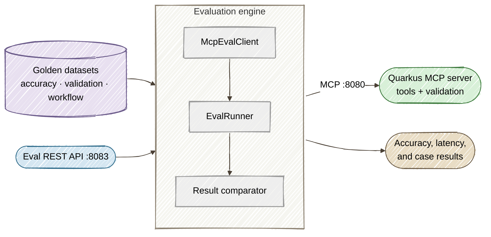

# Part 5: Automated Agent Evaluation and Regression Testing for MCP Tool Services

[Tutorial home](index.md) · [Run the example](https://github.com/danieloh30/governed-agent-platform/tree/main/part5-evaluation) · [Enterprise deep dives](../enterprise/index.md)

> **Lab contract:** You will run deterministic golden cases against a local MCP server. A release program should also execute through the gateway, cover identity and tenant matrices, test policy denial and dependency failure, version dataset provenance, detect sensitive telemetry, and require a reviewed waiver when a threshold is overridden.

> **TL;DR** — Build an automated evaluation framework that uses golden datasets to verify MCP tool accuracy, validate Bean Validation boundaries, and catch regressions in multi-step agent workflows — all runnable from CI/CD.

> **Enterprise context — Acme FinServ.** A SOC 2 control is only real if it *keeps working*.
> Acme's auditors don't just want to see that the `@Pattern` validation boundary (Part 1) or the
> HITL gate (Part 4) exist today — they want evidence the controls **can't silently regress**.
> This part turns that into **continuous control validation**: golden datasets that fail the CI
> build the moment a refactor relaxes a validation constraint or changes a governed tool's output.
> The `validation-boundary` suite is, in effect, an automated auditor that runs on every pull
> request.

## The Core Problem

In [Part 1](01-governed-mcp-tools.md) we built a Quarkus MCP tool server with Jakarta Bean Validation. In [Part 2](02-agentgateway-security.md) we secured it with agentgateway. In [Part 3](03-observability.md) we added distributed tracing. In [Part 4](04-multi-agent-governance.md) we orchestrated multi-agent workflows with A2A. The architecture works, it is secure, and it is observable — but how do you know it stays correct across code changes?

Manual testing with Goose catches obvious breakages. Ask it to debug a customer, and if the tool throws an exception, you will notice. But manual testing has structural gaps that compound as the codebase grows:

- **No systematic coverage.** Developers test the happy path — `CUST-4091` returns `ACTIVE` — but skip the edge cases. What about `CUST-9999` (not found)? What about `CUST-7734` (suspended)?
- **No regression detection.** A refactor that accidentally changes `ENTERPRISE_TIER` to `ENTERPRISE` in `getCustomerStatus` will not be caught until an agent downstream makes a wrong decision based on that string.
- **No validation boundary testing.** The `@Pattern(regexp = "^CUST-[0-9]{4,8}$")` constraint on `customerId` is the security boundary between LLM hallucinations and your business logic. If someone relaxes it — or removes it during a refactor — you need to know immediately.
- **No workflow-level testing.** A multi-step agent workflow like *"debug customer CUST-4091 -> check region health -> verify SLA"* chains three tool calls where each step depends on the previous result. Unit tests on individual tools cannot catch integration breakages.

The solution is an **evaluation framework** that treats MCP tool services like any other API: define expected inputs and outputs in golden datasets, run them automatically, and fail the build if accuracy drops.

## Architecture



The Eval Runner is a standalone Quarkus application that:

1. **Loads golden datasets** from JSON files defining expected tool inputs, outputs, and error conditions
2. **Connects to the MCP server** via raw HTTP using the same JSON-RPC protocol that Goose uses
3. **Executes test cases** — calling each tool and comparing results against golden expectations
4. **Generates evaluation reports** with accuracy, latency percentiles (p50/p95/p99), and per-case pass/fail details
5. **Exposes a REST API** so evaluations can be triggered programmatically from CI/CD pipelines

## Prerequisites

Everything from Part 1, plus:

- **Part 1 MCP server built** — `cd part1-quarkus-mcp && mvn package -DskipTests`

## Step 1: Designing Golden Datasets

Golden datasets are JSON files that define expected behavior for MCP tools. Each file targets a different kind of verification. We define three dataset types that together cover the full testing surface.

### Tool Accuracy: Verifying Correct Output

The `tool-accuracy.json` suite tests each MCP tool with known inputs and verifies exact field matches in the output:

```json
{
  "name": "tool-accuracy",
  "description": "Verify correct output for each MCP tool with known inputs",
  "cases": [
    {
      "id": "customer-active-enterprise",
      "description": "Active enterprise customer returns correct status and region",
      "tool": "getCustomerStatus",
      "arguments": {"customerId": "CUST-4091"},
      "expect": {
        "customerId": "CUST-4091",
        "status": "ACTIVE",
        "tier": "ENTERPRISE_TIER",
        "primaryRegion": "US-EAST-1"
      }
    },
    {
      "id": "zone-health-entries",
      "description": "Zone health returns exactly 6 diagnostic entries",
      "tool": "getZoneHealthLogs",
      "arguments": {"zoneId": "US-EAST-1"},
      "expectCount": 6
    }
  ]
}
```

The `expect` field does a partial match — only the listed fields are checked, so the test is resilient to new fields being added. The `expectCount` field verifies array length without inspecting individual entries.

### Validation Boundary: Testing Security Constraints

The `validation-boundary.json` suite verifies that Jakarta Bean Validation rejects malformed inputs at the MCP boundary:

```json
{
  "name": "validation-boundary",
  "description": "Verify Jakarta Bean Validation rejects malformed inputs at the MCP boundary",
  "cases": [
    {
      "id": "customer-sql-injection",
      "description": "SQL injection payload rejected by pattern constraint",
      "tool": "getCustomerStatus",
      "arguments": {"customerId": "'; DROP TABLE users; --"},
      "expectError": true,
      "errorContains": "must match"
    },
    {
      "id": "audit-xss-payload",
      "description": "XSS payload in customer ID rejected by pattern constraint",
      "tool": "getAuditTrail",
      "arguments": {"customerId": "<script>alert(1)</script>"},
      "expectError": true,
      "errorContains": "must match"
    }
  ]
}
```

Setting `expectError: true` means the test passes only if the tool returns an error. The `errorContains` field verifies the error message includes the expected validation message (e.g., `"must match"` from `@Pattern`). This catches two classes of regression: constraints being removed entirely, and constraints being relaxed to accept wider input.

### Workflow Regression: Testing Multi-Step Agent Behavior

The `workflow-regression.json` suite tests the multi-step sequences that AI agents actually execute. Each workflow chains tool calls where outputs from one step feed into the next:

```json
{
  "name": "workflow-regression",
  "description": "Verify multi-step agent workflows produce correct chained results",
  "workflows": [
    {
      "id": "customer-debug-workflow",
      "description": "Debug customer: lookup status, check region health, verify SLA",
      "steps": [
        {
          "id": "lookup-customer",
          "tool": "getCustomerStatus",
          "arguments": {"customerId": "CUST-4091"},
          "expect": {"status": "ACTIVE", "primaryRegion": "US-EAST-1"},
          "extractField": "primaryRegion",
          "extractAs": "region"
        },
        {
          "id": "check-region-health",
          "tool": "getZoneHealthLogs",
          "arguments": {"zoneId": "${region}"},
          "expectCount": 6
        },
        {
          "id": "verify-sla",
          "tool": "getSLACompliance",
          "arguments": {"serviceId": "api-gateway"},
          "expect": {"compliancePct": 99.97, "violationCount": 0}
        }
      ]
    }
  ]
}
```

The `extractField` and `extractAs` fields enable variable passing between steps. In this workflow, step 1 extracts `primaryRegion` from the `getCustomerStatus` result and stores it as `region`. Step 2 uses `${region}` in its arguments — the eval runner substitutes the extracted value before calling the tool. This mirrors exactly what Goose does when it chains tool calls: read a result, extract a value, pass it to the next tool.

### Assertion Types Summary

| Assertion | Fields | Purpose |
|-----------|--------|---------|
| Exact match | `expect` | Verify specific field values in tool output |
| Count | `expectCount` | Verify array length (zone health logs, audit events) |
| Error | `expectError` + `errorContains` | Verify validation rejects input with correct message |
| Workflow chaining | `extractField` + `extractAs` | Pass output from one step as input to the next |

## Step 2: Building the MCP Eval Client

The eval client needs to speak the MCP wire protocol — JSON-RPC over Streamable HTTP, the same transport Goose and agentgateway use. We *could* hand-roll that with `java.net.http.HttpClient`: build the JSON-RPC envelope, manage an incrementing request id, send an `initialize` handshake, and parse responses that arrive as either plain JSON or Server-Sent Events (`data:`-prefixed lines). That's ~60 lines of protocol plumbing that has nothing to do with evaluation.

Instead we reuse the **managed `McpClient`** from `quarkus-langchain4j-mcp` — the exact extension Part 4 introduced for agent-to-tool calls. The transport, handshake, and SSE-vs-JSON handling all disappear into the extension:

```java
@ApplicationScoped
public class McpEvalClient {

    @Inject
    @McpClientName("mcp-under-test")
    McpClient mcpClient;

    @Inject
    ObjectMapper mapper;

    public String callTool(String toolName, Map<String, Object> arguments)
            throws Exception {
        String argsJson = mapper.writeValueAsString(arguments);
        var result = mcpClient.executeTool(
                ToolExecutionRequest.builder()
                        .name(toolName)
                        .arguments(argsJson)
                        .build());
        return result.resultText();
    }

    public JsonNode callToolAsJson(String toolName, Map<String, Object> arguments)
            throws Exception {
        String text = callTool(toolName, arguments);
        if (text == null || text.isBlank()) {
            return mapper.createObjectNode();
        }
        try {
            return mapper.readTree(text);
        } catch (Exception e) {
            return mapper.valueToTree(Map.of("text", text));
        }
    }

    public int getToolCount() {
        return mcpClient.listTools().size();
    }
}
```

The whole client is now ~35 lines and contains **zero** protocol code — `mcpClient.executeTool(...)` handles the JSON-RPC envelope, the `initialize` handshake, and the SSE/JSON response formats transparently. The only Jackson we keep is for the eval-specific concern of turning tool output into a `JsonNode` we can assert against. This is the same boilerplate-reduction lesson from Parts 1–4, applied to the test harness itself: let the extension own the wire protocol.

The client is configured declaratively in `application.properties` — no endpoint parsing code, just point the named client at any MCP-compatible server:

```properties
# The MCP server under test (Part 1 directly)
quarkus.langchain4j.mcp.mcp-under-test.transport-type=streamable-http
quarkus.langchain4j.mcp.mcp-under-test.url=http://localhost:8080/mcp

# Through agentgateway (Part 2) — just change the URL:
# quarkus.langchain4j.mcp.mcp-under-test.url=http://localhost:3000/mcp
```

## Step 3: Implementing the Evaluation Engine

The `EvalRunner` loads golden datasets, executes each case, and generates reports.

### Data Model

The evaluation framework uses four Java records:

```java
@JsonIgnoreProperties(ignoreUnknown = true)
public record EvalCase(
        String id,
        String description,
        String tool,
        Map<String, Object> arguments,
        JsonNode expect,
        boolean expectError,
        Integer expectCount,
        String errorContains,
        String extractField,
        String extractAs) {
}

@JsonIgnoreProperties(ignoreUnknown = true)
public record EvalSuite(
        String name,
        String description,
        List<EvalCase> cases,
        List<WorkflowCase> workflows) {

    @JsonIgnoreProperties(ignoreUnknown = true)
    public record WorkflowCase(
            String id,
            String description,
            List<EvalCase> steps) {
    }
}

public record EvalResult(
        String caseId,
        String tool,
        boolean passed,
        long latencyMs,
        JsonNode actual,
        JsonNode expected,
        String error) {

    public static EvalResult pass(String caseId, String tool,
            long latencyMs, JsonNode actual) {
        return new EvalResult(caseId, tool, true, latencyMs,
                actual, null, null);
    }

    public static EvalResult fail(String caseId, String tool,
            long latencyMs, JsonNode actual, JsonNode expected,
            String error) {
        return new EvalResult(caseId, tool, false, latencyMs,
                actual, expected, error);
    }
}
```

The `EvalReport` record calculates aggregate metrics from the list of results:

```java
public record EvalReport(
        String suiteName,
        String timestamp,
        int total,
        int passed,
        int failed,
        double accuracy,
        LatencyStats latency,
        List<EvalResult> results) {

    public record LatencyStats(long p50, long p95, long p99, long max) {
    }

    public static EvalReport from(String suiteName,
            List<EvalResult> results) {
        int passed = (int) results.stream()
                .filter(EvalResult::passed).count();
        int total = results.size();
        double accuracy = total > 0
                ? (double) passed / total * 100.0 : 0.0;

        List<Long> latencies = results.stream()
                .map(EvalResult::latencyMs)
                .sorted()
                .toList();

        LatencyStats stats = latencies.isEmpty()
                ? new LatencyStats(0, 0, 0, 0)
                : new LatencyStats(
                        percentile(latencies, 50),
                        percentile(latencies, 95),
                        percentile(latencies, 99),
                        latencies.getLast());

        return new EvalReport(suiteName, Instant.now().toString(),
                total, passed, total - passed, accuracy,
                stats, results);
    }

    private static long percentile(List<Long> sorted, int p) {
        int idx = Math.min(
                (int) Math.ceil(p / 100.0 * sorted.size()) - 1,
                sorted.size() - 1);
        return sorted.get(Math.max(0, idx));
    }
}
```

### Core Evaluation Logic

The `EvalRunner` service handles both individual cases and multi-step workflows:

```java
@ApplicationScoped
public class EvalRunner {

    @Inject
    McpEvalClient client;

    @Inject
    ObjectMapper mapper;

    public EvalReport runSuite(String name) throws Exception {
        EvalSuite suite = loadSuite(name);
        List<EvalResult> results = new ArrayList<>();

        if (suite.cases() != null) {
            for (EvalCase evalCase : suite.cases()) {
                results.add(runCase(evalCase));
            }
        }

        if (suite.workflows() != null) {
            for (EvalSuite.WorkflowCase workflow : suite.workflows()) {
                results.addAll(runWorkflow(workflow));
            }
        }

        return EvalReport.from(suite.name(), results);
    }
```

For individual test cases, the runner calls the MCP tool, checks for errors, then applies the appropriate assertion:

```java
    private EvalResult runCase(EvalCase evalCase) {
        long start = System.currentTimeMillis();
        try {
            JsonNode response = client.callTool(
                    evalCase.tool(), evalCase.arguments());
            long latency = System.currentTimeMillis() - start;

            // Check for JSON-RPC error
            if (response.has("error")) {
                String errorMsg = response.path("error")
                        .path("message").asText("");
                if (evalCase.expectError()) {
                    if (evalCase.errorContains() != null
                            && !errorMsg.contains(evalCase.errorContains())) {
                        return EvalResult.fail(evalCase.id(),
                                evalCase.tool(), latency,
                                response.get("error"), null,
                                "Error message does not contain: "
                                + evalCase.errorContains());
                    }
                    return EvalResult.pass(evalCase.id(),
                            evalCase.tool(), latency,
                            response.get("error"));
                }
                return EvalResult.fail(evalCase.id(),
                        evalCase.tool(), latency,
                        response.get("error"), null,
                        "Unexpected error: " + errorMsg);
            }

            // Parse content and apply assertions
            JsonNode content = response.path("result").path("content");
            JsonNode actual = parseContent(content);

            if (evalCase.expectCount() != null) {
                int count = actual.isArray() ? actual.size() : 1;
                if (count != evalCase.expectCount()) {
                    return EvalResult.fail(evalCase.id(),
                            evalCase.tool(), latency,
                            mapper.valueToTree(Map.of("count", count)),
                            mapper.valueToTree(Map.of("count",
                                    evalCase.expectCount())),
                            "Expected " + evalCase.expectCount()
                            + " items, got " + count);
                }
                return EvalResult.pass(evalCase.id(),
                        evalCase.tool(), latency, actual);
            }

            if (evalCase.expect() != null) {
                String mismatch = compareFields(actual,
                        evalCase.expect());
                if (mismatch != null) {
                    return EvalResult.fail(evalCase.id(),
                            evalCase.tool(), latency,
                            actual, evalCase.expect(), mismatch);
                }
            }

            return EvalResult.pass(evalCase.id(),
                    evalCase.tool(), latency, actual);

        } catch (Exception e) {
            long latency = System.currentTimeMillis() - start;
            return EvalResult.fail(evalCase.id(), evalCase.tool(),
                    latency, null, evalCase.expect(),
                    "Exception: " + e.getMessage());
        }
    }
```

### Workflow Variable Substitution

Multi-step workflows maintain an extraction map. After each step, if `extractField` and `extractAs` are specified, the runner pulls the named field from the result and stores it for use in subsequent steps:

```java
    private List<EvalResult> runWorkflow(
            EvalSuite.WorkflowCase workflow) {
        List<EvalResult> results = new ArrayList<>();
        Map<String, String> extractions = new HashMap<>();

        for (EvalCase step : workflow.steps()) {
            Map<String, Object> resolvedArgs = new HashMap<>();
            for (var entry : step.arguments().entrySet()) {
                String val = String.valueOf(entry.getValue());
                for (var ext : extractions.entrySet()) {
                    val = val.replace("${" + ext.getKey() + "}",
                            ext.getValue());
                }
                resolvedArgs.put(entry.getKey(), val);
            }

            EvalCase resolved = new EvalCase(
                    workflow.id() + "/" + step.id(),
                    step.description(), step.tool(), resolvedArgs,
                    step.expect(), step.expectError(),
                    step.expectCount(), step.errorContains(),
                    step.extractField(), step.extractAs());

            EvalResult result = runCase(resolved);
            results.add(result);

            if (result.passed() && step.extractField() != null
                    && step.extractAs() != null
                    && result.actual() != null) {
                JsonNode val = result.actual()
                        .path(step.extractField());
                if (!val.isMissingNode()) {
                    extractions.put(step.extractAs(), val.asText());
                }
            }
        }
        return results;
    }
```

In the `customer-debug-workflow`, this produces the following execution:

1. `getCustomerStatus("CUST-4091")` returns `primaryRegion: "US-EAST-1"` -> extracted as `region`
2. `getZoneHealthLogs("${region}")` resolves to `getZoneHealthLogs("US-EAST-1")` -> verifies 6 entries
3. `getSLACompliance("api-gateway")` -> verifies `compliancePct: 99.97`

If step 1's output changes — say `primaryRegion` is renamed to `region` — step 2 will fail because the extraction produces `null`. This catches exactly the kind of cross-tool contract breakage that unit tests miss.

### Field Comparison

The `compareFields` method does partial matching — it only checks fields present in the `expect` object:

```java
    private String compareFields(JsonNode actual, JsonNode expected) {
        Iterator<String> fields = expected.fieldNames();
        while (fields.hasNext()) {
            String field = fields.next();
            JsonNode expectedVal = expected.get(field);
            JsonNode actualVal = actual.path(field);

            if (actualVal.isMissingNode()) {
                return "Missing field: " + field;
            }

            if (expectedVal.isNumber() && actualVal.isNumber()) {
                if (expectedVal.doubleValue()
                        != actualVal.doubleValue()) {
                    return "Field " + field + ": expected "
                            + expectedVal + ", got " + actualVal;
                }
            } else if (!expectedVal.asText()
                    .equals(actualVal.asText())) {
                return "Field " + field + ": expected "
                        + expectedVal.asText() + ", got "
                        + actualVal.asText();
            }
        }
        return null;
    }
```

This means you can add new fields to tool responses without breaking existing golden tests — only the fields you explicitly check are asserted.

## Step 4: Exposing the REST API

The evaluation engine is wrapped in a Quarkus REST resource so it can be triggered programmatically:

```java
@Path("/eval")
@Produces(MediaType.APPLICATION_JSON)
public class EvalResource {

    @Inject
    EvalRunner runner;

    @GET
    @Path("/suites")
    public List<String> listSuites() {
        return runner.listSuites();
    }

    @GET
    @Path("/suites/{name}")
    public EvalSuite getSuite(@PathParam("name") String name)
            throws Exception {
        return runner.loadSuite(name);
    }

    @POST
    @Path("/run/{suite}")
    public EvalReport runSuite(@PathParam("suite") String suite)
            throws Exception {
        return runner.runSuite(suite);
    }
}
```

| Endpoint | Method | Purpose |
|----------|--------|---------|
| `/eval/suites` | GET | List available golden suite names |
| `/eval/suites/{name}` | GET | Get suite details including all test cases |
| `/eval/run/{suite}` | POST | Execute a suite and return the evaluation report |

Configure the eval runner to listen on port 8083 (separate from the MCP server on 8080):

```properties
quarkus.http.port=8083

# CORS for demo SPA
quarkus.http.cors=true
quarkus.http.cors.origins=/.*/

# Managed MCP client (quarkus-langchain4j-mcp) — the server under test
quarkus.langchain4j.mcp.mcp-under-test.transport-type=streamable-http
quarkus.langchain4j.mcp.mcp-under-test.url=http://localhost:8080/mcp
```

## Step 5: Running the Interactive Demo

Start all services with the one-command script:

```bash
cd part5-evaluation
./start-all.sh
```

The script builds Part 1 and Part 5, starts the MCP server on `:8080`, the eval runner on `:8083`, and the demo SPA on `:8891`.

Open the **MCP Evaluation Console** at [http://localhost:8891/index.html](http://localhost:8891/index.html) and walk through the four demo steps:

1. **Initialize** — Connects to the MCP server at `:8080`, verifies all 5 tools are discoverable. The architecture diagram animates the connection between the Eval Console, the Eval Runner, and the MCP Server.
2. **Load Suite** — Select a golden dataset from the dropdown (tool-accuracy, validation-boundary, or workflow-regression). The test cases appear in a table showing case ID, tool name, and description.
3. **Run Evaluation** — Executes each test case against the MCP server via the eval runner. Watch the results appear in real time with pass/fail indicators. The stat tiles update live: total cases, passed, failed, accuracy percentage, and average latency.
4. **View Report** — Shows the complete evaluation report with accuracy score, latency percentiles (p50/p95/p99/max), and a detailed results table. Click any failed case to inspect the raw JSON showing expected vs. actual values.

## Step 6: Integrating with CI/CD

### Command-Line Evaluation

Run evaluations against a live MCP server using `curl`:

```bash
# Run the tool-accuracy suite
curl -s -X POST http://localhost:8083/eval/run/tool-accuracy | \
  python3 -c "
import sys, json
r = json.loads(sys.stdin.read())
print(f\"Suite: {r['suiteName']}\")
print(f\"Accuracy: {r['accuracy']}%\")
print(f\"Passed: {r['passed']}/{r['total']}\")
print(f\"Latency p50: {r['latency']['p50']}ms  p99: {r['latency']['p99']}ms\")
if r['failed'] > 0:
    for t in r['results']:
        if not t['passed']:
            print(f\"  FAIL: {t['caseId']} - {t['error']}\")
    sys.exit(1)
"
```

### Full Regression Script

Run all three suites and fail if any test case does not pass:

```bash
#!/usr/bin/env bash
set -euo pipefail

EVAL_HOST="${1:-http://localhost:8083}"
EXIT_CODE=0

for suite in tool-accuracy validation-boundary workflow-regression; do
  echo "Running $suite..."
  REPORT=$(curl -s -X POST "$EVAL_HOST/eval/run/$suite")
  ACCURACY=$(echo "$REPORT" | python3 -c \
    "import sys,json; print(json.loads(sys.stdin.read())['accuracy'])")
  FAILED=$(echo "$REPORT" | python3 -c \
    "import sys,json; print(json.loads(sys.stdin.read())['failed'])")
  echo "  Accuracy: $ACCURACY% ($FAILED failures)"
  if [ "$FAILED" -gt 0 ]; then
    echo "  FAILED"
    EXIT_CODE=1
  fi
done

if [ "$EXIT_CODE" -eq 0 ]; then
  echo "All suites passed."
else
  echo "Regression detected — see failures above."
  exit 1
fi
```

### GitHub Actions Integration

Add evaluation as a CI step that runs on every push and pull request:

```yaml
name: MCP Eval
on: [push, pull_request]
jobs:
  eval:
    runs-on: ubuntu-latest
    steps:
      - uses: actions/checkout@v4
      - uses: actions/setup-java@v4
        with:
          java-version: '25'
          distribution: 'temurin'
      - name: Build MCP server and eval runner
        run: mvn package -DskipTests -pl part1-quarkus-mcp,part5-evaluation
      - name: Start MCP server
        run: |
          QUARKUS_OTEL_SDK_DISABLED=true \
            java -jar part1-quarkus-mcp/target/quarkus-app/quarkus-run.jar &
          sleep 5
      - name: Start eval runner
        run: |
          java -jar part5-evaluation/target/quarkus-app/quarkus-run.jar &
          sleep 5
      - name: Run all evaluation suites
        run: |
          for suite in tool-accuracy validation-boundary workflow-regression; do
            echo "=== $suite ==="
            curl -sf -X POST http://localhost:8083/eval/run/$suite | \
              python3 -c "
          import sys, json
          r = json.loads(sys.stdin.read())
          print(f\"  {r['passed']}/{r['total']} passed ({r['accuracy']}%)\")
          assert r['accuracy'] == 100.0, \
            f\"{r['suiteName']}: {r['failed']} failures\"
          "
          done
```

## What We Achieved

| Capability | How |
|---|---|
| **Golden datasets** | JSON files defining expected inputs, outputs, and error conditions for every MCP tool |
| **Tool accuracy testing** | Exact field comparison ensures tool outputs match known-good values |
| **Validation boundary testing** | Verifies Bean Validation rejects SQL injection, XSS, and malformed inputs |
| **Workflow regression testing** | Multi-step agent workflows with variable extraction catch integration breakages |
| **CI/CD integration** | REST API + exit-code script enables automated regression gates |
| **Latency tracking** | P50/P95/P99/max latency per suite detects performance regressions |

### The Business Case (Acme FinServ)

For a platform director or CISO, the value isn't "we have tests" — it's what each control costs
when it *isn't* automated. The suites map directly to avoided business risk:

| Control (suite) | Manual cost today | Automated cost | Business impact |
|-----------------|-------------------|----------------|-----------------|
| `validation-boundary` | A relaxed `@Pattern` is discovered via a production PII/card-data leak → PCI/GDPR incident + audit finding | Fails the PR in seconds | Turns a potential breach into a red CI check |
| `tool-accuracy` | An agent makes a wrong decision on a silently-changed field (`ENTERPRISE_TIER` → `ENTERPRISE`); found by a customer | Caught on every commit | Protects downstream agent decisions and customer trust |
| `workflow-regression` | A broken multi-step workflow surfaces in production support tickets | Caught before merge | Reduces incident volume and MTTD |
| All suites (audit evidence) | Auditor asks "prove the controls still work" → engineers scramble to produce evidence | Every run is timestamped evidence | Cuts SOC 2 audit-prep hours; controls are *continuously* attested |

The one-time cost is writing the golden datasets; the recurring cost is seconds of CI time.
The avoided cost is a single compliance incident.

### Production Considerations

| Concern | Local (this tutorial) | Production |
|---------|----------------------|------------|
| Golden dataset management | JSON files in repo | Versioned alongside tool code, reviewed in PRs |
| Evaluation cadence | On-demand / CI | Every PR + nightly regression suite |
| Accuracy threshold | 100% (strict) | Per-suite thresholds (100% for validation, 95%+ for accuracy) |
| Latency thresholds | Informational | Alerting on P99 > SLA target |
| Workflow coverage | 3 workflows | One per agent use case documented in runbooks |
| Baseline comparison | None | Store baseline reports, diff against previous run |

## Series Recap

This 5-part series built a complete governed AI agent infrastructure:

| Part | What We Built | Key Technology |
|------|--------------|----------------|
| 1 | [MCP tool server with input hardening](01-governed-mcp-tools.md) | Quarkus `@Tool` + Jakarta Bean Validation |
| 2 | [Security proxy with auth and guardrails](02-agentgateway-security.md) | agentgateway JWT, RBAC, ExtMCP |
| 3 | [End-to-end distributed tracing](03-observability.md) | OpenTelemetry + Jaeger |
| 4 | [Multi-agent orchestration with governance](04-multi-agent-governance.md) | A2A protocol + AGENTS.md |
| 5 | [Automated evaluation and regression testing](05-evaluation.md) | Golden datasets + MCP eval runner |

Each layer addresses a different production concern — correctness, security, observability, orchestration, and now continuous verification. Together they provide the governance framework that platform engineers need to safely deploy autonomous AI agents against enterprise infrastructure.
