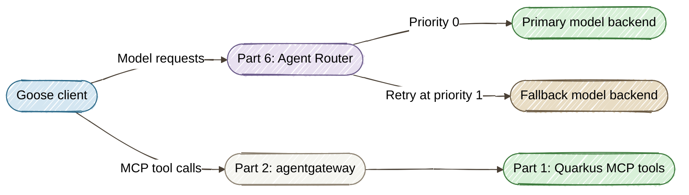
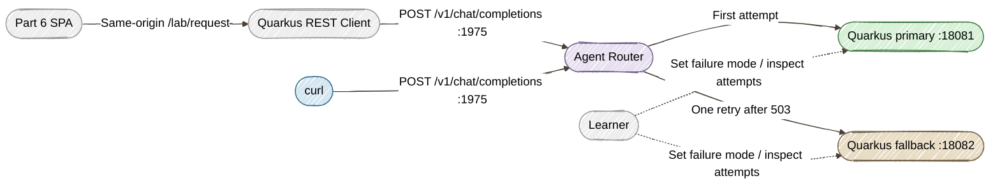
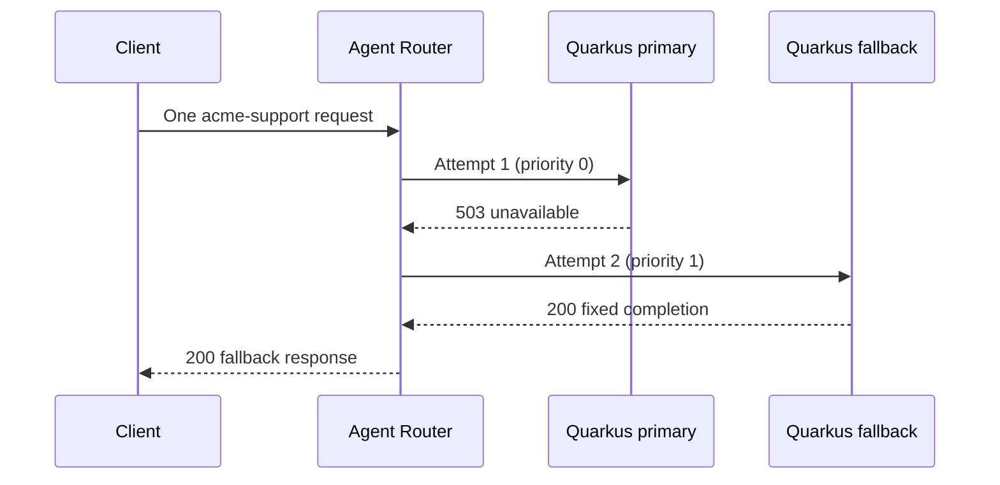

# Part 6: Model Routing and Failover with Agent Router and Quarkus

[Tutorial home](index.md) · [Run the example](https://github.com/danieloh30/governed-agent-platform/tree/main/part6-agent-router) · [Enterprise deep dives](../enterprise/index.md)

> **Lab contract:** You will send non-streaming requests through a real Agent Router to two deterministic Quarkus model backends running from the same application JAR. You will prove model matching, retry boundaries, fallback, and recovery. The stubs return fixed text and illustrative token counts; they do not perform inference or evaluate answer quality. This unauthenticated local lab does not establish production access control or guarantee that different providers produce equivalent answers.

> **TL;DR** — Use the Part 6 Model Routing Console or curl to run two Quarkus REST model backends behind Agent Router to add the model-traffic layer to the governed platform. Use Agent Router to expose one OpenAI-compatible endpoint, select a configured model route, and retry a failed request against a fallback backend — with no API keys, GPU, or Kubernetes cluster required.

> **Enterprise context — Acme FinServ.** Maya has governed Acme's tools, but Goose still
> depends on a model provider to decide what to do next. During a provider outage, Sofia's
> customer-support investigation stalls even though the MCP tools are healthy. Maya needs
> **service continuity with a bounded retry policy**: use an approved fallback, make the
> selected backend visible, and return a clear failure when both backends are unavailable.
> Priya wants repeatable evidence that the configured behavior works. This part supplies
> that evidence through controlled failures, without sending customer data to a provider.

## The Core Problem

[Parts 1–5](index.md) introduced tool validation, gateway security, tracing, workflow approval,
and deterministic MCP evaluation. A model request is a separate network operation from a tool
call. An agent can have authorized access to healthy tools and still be unable to proceed
because its model endpoint is unavailable.

Putting retries into every client creates another policy to maintain. Unlimited retries add
latency; retrying every error can hide a malformed request. Maya needs to answer three questions:

1. Which model names does this endpoint route, and which backend receives the request?
2. Which failures trigger fallback, and how many attempts are allowed?
3. What does the client see when no configured backend can answer?

## The Solution: Govern the Model Request Path

[Agent Router](https://aaif.io/projects/agent-router), formerly Envoy AI Gateway, is an AAIF
project built on Envoy. Its `aigw` CLI runs the gateway locally. This lab uses **Agent Router
v1.1.0**, whose standalone runtime uses **Envoy 1.38.1**. The CLI and configuration API still
contain the earlier `aigw` and `aigateway.envoyproxy.io` names.

The platform has two distinct request paths in this teaching architecture:



**agentgateway** continues to teach MCP identity, authorization, and guardrails. **Agent Router**
adds model routing and resilience. Both projects have broader, overlapping capabilities; this
division keeps each lesson focused. Model routing also differs from [Part 4's A2A task
delegation](04-multi-agent-governance.md): selecting a model endpoint does not delegate a
business workflow or grant approval to execute a tool.

The required exercise uses an HTTP client and two instances of one Quarkus application to simulate model providers:



The Quarkus backends return fixed completions and never forward requests to each other. The real gateway makes every routing and retry
decision. Both backends expose the same `acme-model-v1` contract so you can isolate transport
behavior from differences between model providers.

## Prerequisites

- **Time:** 30 minutes after installation: start (5), route (10), fail over (10), verify (5).
- **Platform:** macOS on Apple Silicon, or Linux on x86_64/ARM64. The pinned release does not
  provide a macOS Intel or native Windows binary; use a supported Linux environment there.
- **Java 25+**, **Maven 3.9+**, **Bash**, and **curl**. The installer uses `sha256sum` (Linux) or `shasum` (macOS); the core lab has no Python dependency.
- Internet access for initial Maven dependencies, CLI, and Envoy downloads. Subsequent cached runs use local stubs.
- Ports **1975**, **1064**, **18081**, and **18082** available. The runtime also uses internal
  Envoy listener ports; its startup log identifies any conflicts.

Read Parts 1 and 2 for context; their services do not need to run. Parts 3–5 provide useful
background but are not runtime prerequisites. This chapter does not change their
startup commands or provider settings. Part 6 is now a Maven module in the root build.

Install the pinned CLI before the timed exercise:

```bash
# From the repository root
cd part6-agent-router
./install.sh
mvn package -DskipTests
```

The installer verifies the release asset's SHA-256 checksum and places the executable in
`.bin/aigw`. It does not change your global PATH or Goose configuration. On the first start,
Agent Router downloads its pinned Envoy binary into the lab's ignored `.runtime/` directory.
Allow extra time for that download when preparing a workshop.

## Step 1: Start the Model Traffic Lab (5 Minutes)

In the same terminal:

```bash
./start-all.sh
```

Wait for `Ready: http://localhost:1975/v1/chat/completions`. Keep this terminal open. The
launcher builds the application, starts two Quarkus processes and Agent Router, and checks
readiness. Logs are in `.runtime/primary.log`, `.runtime/fallback.log`, and `.runtime/gateway.log`.
Ctrl+C stops the services owned by this invocation. After a build, `SKIP_BUILD=true ./start-all.sh`
reuses the packaged application.

### Open the Model Routing Console

Open **http://localhost:18081/**. Part 6 has its own SPA in `part6-agent-router/index.html`,
using the same visual layout and theme switch as the earlier labs. Quarkus serves the page
and its `/lab/*` API together, so there is no separate web server or browser CORS setup.

Choose the console or the equivalent terminal commands below for each exercise; you do not
need to repeat both paths. The four tutorial steps still take about 30 minutes.

| Console action | What you observe |
|---|---|
| **Primary Route** | HTTP 200, primary response, attempts `1 / 0` |
| **Unmatched Model** | HTTP 404, attempts `0 / 0` |
| **Fail Over** | Primary set to 503, fallback answers 200, attempts `1 / 1` |
| **Recover** | Healthy primary answers again, attempts `1 / 0` |
| **Run All Six Checks** | The Java verifier checks all six cases and restores healthy state |

Each guided scenario begins with fresh counters. Use **Send a Model Request** for custom
model names and **Backend Controls** for the other failure cases. The diagram, attempt counts,
request log, and response inspector reflect actual backend state and gateway responses.
**Reset** restores both backends to healthy. Avoid running curl or smoke checks concurrently
with the console's verifier because they share backend counters.

### One Quarkus Application, Two Backend Instances

The supplied application uses familiar patterns from the earlier Java labs:

- **Quarkus REST and Jackson** expose `POST /v1/chat/completions` and `GET`/`POST /admin`.
- **Bean Validation** rejects missing models, empty messages, and streaming requests before
  recording an upstream attempt.
- **CDI** gives each process its own `ModelService`, failure mode, and attempt counter.
- **SmallRye Health** exposes `/q/health/ready` for startup checks. A simulated provider 503
  leaves the process ready so the failure exercise remains under your control.
- **Quarkus command mode and REST Client** launch the lab and verify actual gateway responses.

Open `src/main/java/com/example/router/ModelResource.java`. Its completion endpoint delegates
state changes to the service:

```java
@POST
@Path("v1/chat/completions")
public Response complete(@NotNull @Valid CompletionRequest request) {
    Result result = service.complete(request);
    return Response.status(result.status()).entity(result.body()).build();
}
```

The launcher runs the same `target/quarkus-app/quarkus-run.jar` twice with different
`quarkus.http.port` and `model.backend-name` values. The primary uses `18081`/`primary`; the
fallback uses `18082`/`fallback`. There is no shared mutable state between them. The launcher
and verifier use the `cli` profile, which disables their HTTP listener.

Click **Primary Route** in the console. For the terminal path, open a second terminal at
`part6-agent-router/` and define a helper for the remaining exercises:

```bash
ask_model() {
  curl -sS --max-time 15 -w '\nHTTP %{http_code}\n' \
    http://localhost:1975/v1/chat/completions \
    -H 'Content-Type: application/json' \
    -d "{\"model\":\"${1:-acme-support}\",\"stream\":false,\"messages\":[{\"role\":\"user\",\"content\":\"Summarize Acme support status.\"}]}"
}
ask_model
```

Expect **HTTP 200** with content beginning `primary:`. This confirms that a request passed
through Agent Router; the returned sentence is fixed stub text, not a generated assessment.

!!! note "Local demo endpoints"
    The stub controls bind to loopback. The gateway uses a development HTTP listener without
    authentication; run on a trusted local machine and do not expose its ports publicly.

## Step 2: Route a Model Request (10 Minutes)

Open `config.yaml` and locate the `AIGatewayRoute`. The meaningful part is:

```yaml
rules:
  - matches:
      - headers:
          - type: Exact
            name: x-ai-eg-model
            value: acme-support
    backendRefs:
      - name: primary
        priority: 0
        modelNameOverride: acme-model-v1
      - name: fallback
        priority: 1
        modelNameOverride: acme-model-v1
```

Agent Router extracts the model name from the JSON request for route matching. Clients request
`acme-support`; the backend receives `acme-model-v1`. Inspect the primary stub's record:

```bash
curl -sS -w '\n' http://localhost:18081/admin
```

`last_model` should be `acme-model-v1`. The `requests` counter counts model attempts, including
failed attempts; reads of `/admin` do not increment it.

In the console, click **Unmatched Model**, or enter `acme-triage` in the Model field and click
**Send Request**. The terminal equivalent is:

```bash
ask_model acme-triage
```

Expect **HTTP 404**. No route matches; neither stub should receive an additional model attempt.
This demonstrates configured route selection, not authenticated access control.

### Make One Routing Change

1. Stop the launcher with Ctrl+C in the first terminal.
2. Change only `value: acme-support` to `value: acme-triage` in `config.yaml`.
3. Restart `./start-all.sh` and wait for readiness.
4. Send `acme-triage` from the console request form, or run `ask_model acme-triage`: expect **200**, with the same upstream
   `acme-model-v1` model. Run `ask_model acme-support`: expect **404**.
5. Stop the launcher, restore `value: acme-support`, and restart before continuing.

**Checkpoint:** You changed the client-facing model route without changing either backend.
The checked-in configuration is the routing policy. The lesson uses explicit restarts so you
do not need to reason about live reload behavior.

## Step 3: Reproduce Failure and Fallback (10 Minutes)

The `BackendTrafficPolicy` in `config.yaml` targets the `HTTPRoute` generated for `acme-models`.
It allows **one retry** after the original attempt, with **one attempt per priority**, a
**two-second per-retry timeout**, and a **ten-second route timeout**. It retries a configured
**503** or a connection failure. This is a deliberately small policy for a predictable lab.

Click **Fail Over** in the console to set primary to 503 and send a request with fresh counters.
For the terminal path, set the primary stub to return 503 and clear both attempt counters:

```bash
curl -sS http://localhost:18081/admin -H 'Content-Type: application/json' \
  -d '{"mode":"unavailable","reset":true}'
curl -sS http://localhost:18082/admin -H 'Content-Type: application/json' \
  -d '{"mode":"healthy","reset":true}'
ask_model
```

Expect **HTTP 200** with content beginning `fallback:`. The client sent one request; the
gateway made two upstream attempts. Inspect the evidence:

```bash
curl -sS -w '\n' http://localhost:18081/admin
curl -sS -w '\n' http://localhost:18082/admin
```

Each stub should report `requests: 1`. This is request-time fallback, not a demonstration of
background health checks or circuit breaking.



### When Both Backends Fail

Leave the primary unavailable. In **Backend Controls**, set fallback to **Unavailable · 503**,
click **Apply Fallback**, then **Send Request**. Terminal equivalent:

```bash
curl -sS http://localhost:18082/admin -H 'Content-Type: application/json' \
  -d '{"mode":"unavailable"}'
ask_model
```

Expect **HTTP 503**, not a successful completion. The retry budget is exhausted; the client
must handle the failure. Fallback does not create availability when all configured backends fail.

### Recover and Respect the Retry Boundary

In **Backend Controls**, apply **Healthy · 200** to fallback and **Bad request · 400** to primary,
then **Send Request**. Terminal equivalent:

```bash
curl -sS http://localhost:18082/admin -H 'Content-Type: application/json' \
  -d '{"mode":"healthy","reset":true}'
curl -sS http://localhost:18081/admin -H 'Content-Type: application/json' \
  -d '{"mode":"bad-request","reset":true}'
ask_model
```

Expect **HTTP 400** and zero fallback attempts. A malformed request is not a provider outage.
Click **Recover** in the console, or restore the primary and send another request:

```bash
curl -sS http://localhost:18081/admin -H 'Content-Type: application/json' \
  -d '{"mode":"healthy","reset":true}'
ask_model
```

Expect **HTTP 200** from `primary:` again.

## Step 4: Verify the Routing Contract (5 Minutes)

With the original `acme-support` configuration running, click **Run All Six Checks** in the
console. The result list comes from the same Java verifier as this terminal command:

```bash
./smoke.sh
```

The Quarkus `RoutingChecks` bean uses REST Client interfaces to reset and change both backends,
then restores healthy state. `./smoke.sh` runs this verifier in Quarkus command mode. Run
them without other clients sending requests so attempt counts remain deterministic.

| Check | Expected evidence |
|---|---|
| Primary healthy | 200, primary completion, attempts `[1, 0]` |
| Unconfigured model | 404, attempts `[0, 0]` |
| Primary returns 503 | 200, fallback completion, attempts `[1, 1]` |
| Primary returns 400 | 400, attempts `[1, 0]` |
| Both return 503 | 503, attempts `[1, 1]` |
| Primary restored | 200, primary completion, attempts `[1, 0]` |

Expect `6/6 routing checks passed`. A failed check produces a nonzero exit code. This applies
[Part 5's regression-testing approach](05-evaluation.md) to a new HTTP boundary; the existing
MCP evaluator and its datasets remain independent.

The Quarkus endpoint tests run with `mvn test` from `part6-agent-router/` and require no Agent
Router process. They complement the six routing checks: endpoint tests validate the model
simulator, while the command-mode verifier validates the real gateway and two running backends.

Stop the launcher with Ctrl+C. For a repeatable start-test-stop run, including CI:

```bash
./start-all.sh --smoke
```

The Java launcher cleans up its owned process trees even when a smoke check fails. It refuses occupied
ports rather than stopping another lab. Downloaded binaries and diagnostic logs remain under
the ignored `.bin/` and `.runtime/` directories for later runs.

## What We Achieved

| Capability | How |
|---|---|
| Stable model endpoint | One OpenAI-compatible endpoint at `:1975` |
| Configured model selection | Exact route match and a shared upstream model contract |
| Bounded fallback | Priorities, explicit retry triggers, and one retry |
| Visible failure | A 503 when both backends fail; a 400 is not retried |
| Consistent guided UI | A separate Part 6 SPA served by Quarkus, with live controls and response inspection |
| Repeatable control evidence | Six Quarkus REST Client checks against the real gateway |
| Java backend contracts | Quarkus endpoint tests for responses, validation, state changes, and readiness |

### The Business Case (Acme FinServ)

Maya now has a configuration she can review, Sofia can reproduce a provider outage without
disrupting real services, and Priya can inspect a repeatable routing test result. These are
evidence of the demonstrated policy behavior, not proof of model quality or a compliance
certification. Together with Parts 1–5, this adds resilience at the model-request boundary
while preserving the tool and workflow governance learners already built.

### Production Considerations

| Concern | Local (this tutorial) | Production |
|---|---|---|
| Identity and credentials | Unauthenticated listener; no provider secrets | Authenticate clients; centrally manage upstream credentials |
| Backend equivalence | Fixed stubs with one shared model contract | Verify model capability, tool calling, schema translation, and data handling for each fallback |
| Retry safety | Non-streaming requests; 503/connect-failure policy | Test timeout, cancellation, streaming, and duplicate processing/billing behavior |
| Provider eligibility | Two local endpoints | Explicitly approve provider, region, and data-residency boundaries |
| Observability | Stub attempt counters and local gateway logs | Monitor errors, latency, selected backend, and usage with telemetry content controls |
| Validation | Deterministic transport checks | Add live-provider contract tests and separate answer-quality evaluations |

## Optional Follow-Up Exercises

These are separate extensions, outside the 30-minute lab. Allow installation/model-download
time in addition to the estimates. Complete the core smoke checks before changing its backends.

- **Connect Goose to real inference (15–20 minutes).** Use the [Agent Router standalone
  guide](https://theagentrouter.ai/docs/cli/aigwrun/) to create a separate Ollama or hosted-provider
  configuration. In [Goose's provider setup](https://block.github.io/goose/docs/getting-started/providers/),
  add an OpenAI-compatible provider using the endpoint format required by your Goose version.
  Keep the existing MCP extension pointing to agentgateway. Use a model that supports tool
  calling, repeat a Part 1 customer-status task, and verify both request paths. The supplied
  stubs cannot power a Goose tool loop. Preserve the original Goose provider for switching back.
- **Trace model requests in Jaeger (10–15 minutes).** Reuse [Part 3's collector](03-observability.md)
  and the [Agent Router OpenTelemetry configuration](https://theagentrouter.ai/docs/cli/aigwrun/#opentelemetry).
  Select `gen_ai` conventions and keep message-content capture disabled. Verify that a model
  span arrives before attempting to correlate it with MCP spans; a shared collector alone
  does not establish shared trace context.
- **Explore token quotas (20–30 minutes).** Follow the [quota policy guide](https://theagentrouter.ai/docs/capabilities/traffic/quota-policy/)
  in a separate setup with Redis and the required Envoy Gateway rate-limit configuration.
  Observe usage accounting and later-request rejection. The stubs' token counts are illustrative;
  they cannot measure real model consumption. Completed-response accounting is not a guarantee
  that an admitted request stops exactly at a spending limit.

## Further Reading

- [Quarkus REST and JSON](https://quarkus.io/guides/rest-json)
- [Quarkus REST Client](https://quarkus.io/guides/rest-client)
- [Quarkus command mode](https://quarkus.io/guides/command-mode-reference)
- [Agent Router at AAIF](https://aaif.io/projects/agent-router)
- [Pinned Agent Router v1.1.0 release](https://github.com/theagentrouter/agent-router/releases/tag/v1.1.0)
- [Standalone CLI](https://theagentrouter.ai/docs/cli/aigwrun/)
- [Provider fallback and retry configuration](https://theagentrouter.ai/docs/capabilities/traffic/provider-fallback/)

This completes the six-part learning path: validate tools, secure access, observe execution,
govern workflows, test controls, and make model requests resilient. Each lab remains
independently runnable; the follow-up exercises above are optional extensions.
