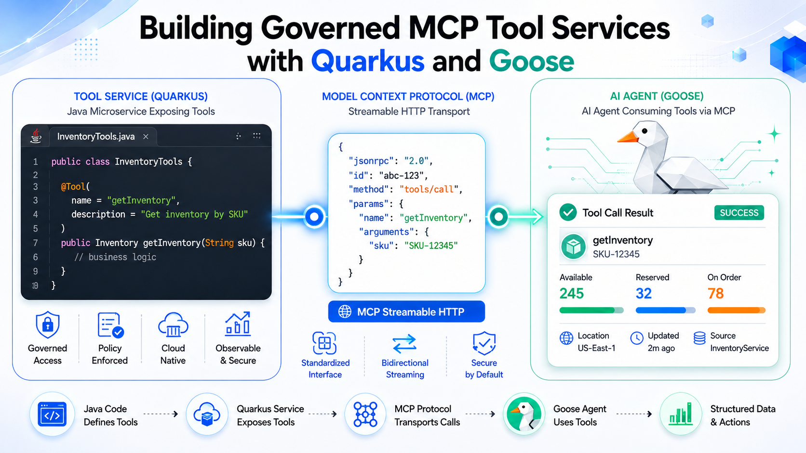
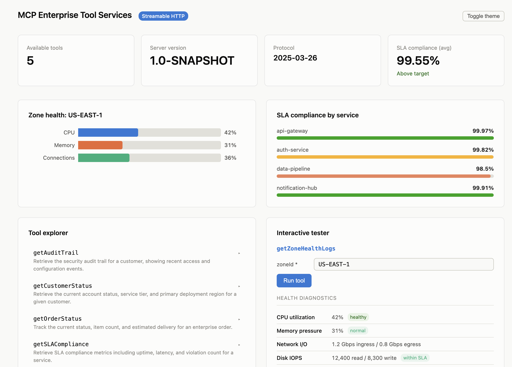

# Building Governed MCP Tool Services with Quarkus and Goose (Part 1)

This project demonstrates how to expose a Quarkus-based Java microservice as a **stateless Model Context Protocol (MCP) server** that the [Goose AI Agent](https://block.github.io/goose/) can discover and invoke over Streamable HTTP.





## Prerequisites

- **Java 25+** -- verify with `java -version`
- **Maven 3.9+** -- verify with `mvn --version`
- **Goose CLI** -- install from [block.github.io/goose](https://block.github.io/goose/)

## Quick Start

### 1. Start the MCP Server in Dev Mode

```bash
mvn quarkus:dev
```

The MCP Streamable HTTP endpoint becomes available at `http://localhost:8080/mcp`.

### 2. Register with Goose

Add the MCP server as a Goose extension by copying `goose-extension-config.yaml` into your Goose config:

```bash
mkdir -p ~/.config/goose
cp goose-extension-config.yaml ~/.config/goose/config.yaml
```

Or add the `customer-tools` block to your existing `~/.config/goose/config.yaml`.

### 3. Test with Goose

Launch Goose and try these prompts:

```
Check customer status for CUST-4091 and verify health logs for their region
```

```
Look up customer CUST-0001 and tell me what zone they are in
```

```
Get zone health logs for US-EAST-1
```

## Verifying with curl

You can test the MCP endpoint directly without Goose. The Streamable HTTP transport requires the `Accept: application/json, text/event-stream` header.

### Initialize the MCP Session

```bash
curl -s http://localhost:8080/mcp \
  -H "Content-Type: application/json" \
  -H "Accept: application/json, text/event-stream" \
  -d '{"jsonrpc":"2.0","id":1,"method":"initialize","params":{"protocolVersion":"2025-03-26","capabilities":{},"clientInfo":{"name":"curl","version":"1.0"}}}' | jq .
```

### List Available Tools

```bash
curl -s http://localhost:8080/mcp \
  -H "Content-Type: application/json" \
  -H "Accept: application/json, text/event-stream" \
  -d '{"jsonrpc":"2.0","id":2,"method":"tools/list","params":{}}' | jq .
```

### Invoke getCustomerStatus

```bash
curl -s http://localhost:8080/mcp \
  -H "Content-Type: application/json" \
  -H "Accept: application/json, text/event-stream" \
  -d '{"jsonrpc":"2.0","id":3,"method":"tools/call","params":{"name":"getCustomerStatus","arguments":{"customerId":"CUST-4091"}}}' | jq .
```

### Invoke getZoneHealthLogs

```bash
curl -s http://localhost:8080/mcp \
  -H "Content-Type: application/json" \
  -H "Accept: application/json, text/event-stream" \
  -d '{"jsonrpc":"2.0","id":4,"method":"tools/call","params":{"name":"getZoneHealthLogs","arguments":{"zoneId":"US-EAST-1"}}}' | jq .
```

## Project Structure

```
part1-quarkus-mcp/
├── pom.xml
├── goose-extension-config.yaml
├── README.md
├── assets/images/
│   ├── mcp_goose_part1.png
│   └── mcp_ui.png
└── src/main/
    ├── java/com/example/mcp/
    │   ├── model/
    │   │   ├── AuditEvent.java
    │   │   ├── CustomerStatusResponse.java
    │   │   ├── OrderStatusResponse.java
    │   │   └── SLAComplianceResponse.java
    │   └── tools/
    │       └── CustomerServiceTools.java
    └── resources/
        ├── META-INF/resources/
        │   └── index.html
        └── application.properties
```

## Key Dependencies

| Dependency | Purpose |
|------------|---------|
| `io.quarkiverse.mcp:quarkus-mcp-server-http` | Quarkus MCP Server with Streamable HTTP transport |
| `io.quarkus:quarkus-rest-jackson` | REST + Jackson JSON serialization |
| `io.quarkus:quarkus-hibernate-validator` | Bean Validation for tool parameter sanitization |

## Exposed MCP Tools

| Tool | Description | Parameters |
|------|-------------|------------|
| `getCustomerStatus` | Returns account status, tier, and region for a customer | `customerId` (format: `CUST-XXXX`) |
| `getZoneHealthLogs` | Returns health-check metrics for an availability zone | `zoneId` (e.g., `US-EAST-1`) |
| `getOrderStatus` | Tracks status, items, amount, and delivery for an enterprise order | `orderId` (format: `ORD-XXXXXXXX`) |
| `getSLACompliance` | Returns SLA compliance %, uptime, p99 latency, and violations | `serviceId` (e.g., `api-gateway`) |
| `getAuditTrail` | Returns security audit events for a customer | `customerId` (format: `CUST-XXXX`) |

## Configuration

Key settings in `src/main/resources/application.properties`:

| Property | Value | Purpose |
|----------|-------|---------|
| `quarkus.http.port` | `8080` | HTTP listen port |
| `quarkus.mcp-server.http.root-path` | `/mcp` | MCP Streamable HTTP endpoint path |
| `quarkus.mcp-server.server-info.name` | `customer-tools` | MCP server name advertised during initialization |
| `quarkus.mcp-server.server-info.version` | `1.0.0` | MCP server version |

## Building for Production

```bash
mvn clean package
java -jar target/quarkus-app/quarkus-run.jar
```

## What's Next

- **[Part 2: Securing and Scaling Goose-to-Java Agent Traffic with agentgateway](../part2-agentgateway/)** — Adds JWT authentication, tool-level RBAC, and ExtMCP guardrails against tool poisoning using the Linux Foundation's agentgateway proxy.
- **Part 3: End-to-End Tracing and Observability Across Goose, agentgateway, and Quarkus** — Coming soon.
