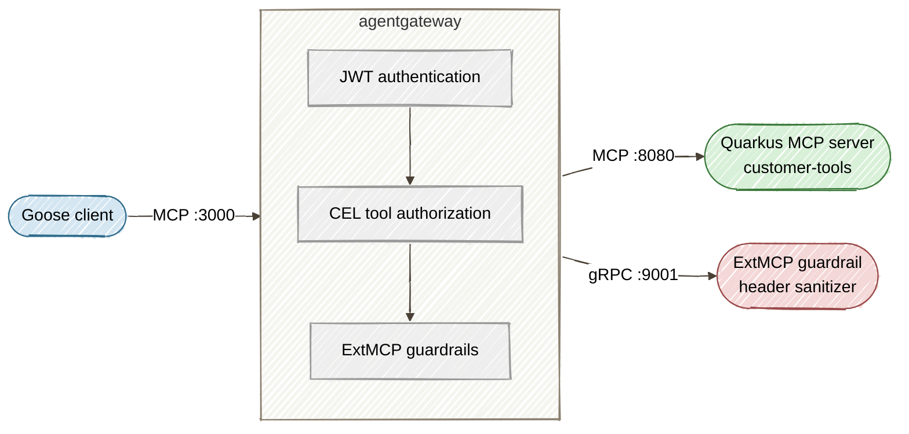

# Part 2: Securing and Scaling Goose-to-Java Agent Traffic with agentgateway

**Long-form guide:** [Part 2 tutorial](../docs/tutorials/02-agentgateway-security.md)

This directory contains the companion demo for Part 2 of the series. It deploys [agentgateway](https://agentgateway.dev) (Linux Foundation) as a security proxy between Goose AI Agent clients and the Quarkus MCP tool server from Part 1.

## Architecture



## Prerequisites

- Everything from Part 1 (Java 25+, Maven 3.9+, Goose CLI)
- **agentgateway** binary: `curl -sL https://agentgateway.dev/install | bash`

## Quick Start

```bash
# From the repository root
cd part2-agentgateway
./start-all.sh
```

This builds and starts the Quarkus MCP server on `:8080` and agentgateway on `:3000`.

To also enable ExtMCP guardrails, pass the guardrails config:

```bash
./start-all.sh agentgateway/config-guardrails.yaml
```

This additionally starts the Quarkus gRPC guardrail server on `:9001`.

## Register with Goose

Point Goose at agentgateway instead of the Quarkus backend:

```bash
cp goose-extension-config.yaml ~/.config/goose/config.yaml
```

The extension URI is `http://localhost:3000/mcp` (agentgateway) instead of `http://localhost:8080/mcp` (direct backend).

## Configuration Files

| File | Purpose |
|------|---------|
| `agentgateway/config-dev.yaml` | Local dev: proxy only, no auth or guardrails (default) |
| `agentgateway/config-guardrails.yaml` | Staging: proxy + ExtMCP guardrails for input sanitization |
| `agentgateway/config.yaml` | Production: JWT auth, RBAC with CEL, and ExtMCP guardrails |
| `goose-extension-config.yaml` | Goose extension pointing to agentgateway |
| `extmcp-guardrail/` | Quarkus gRPC ExtMCP guardrail server |
| `index.html` | Interactive SPA to visualize the demo flow |
| `start-all.sh` | Launches all services |

## Interactive Demo SPA

The `start-all.sh` script automatically serves the SPA on `:8888`. Or serve it manually:

```bash
cd part2-agentgateway
python3 -m http.server 8888
# Open http://localhost:8888/index.html
```

The SPA is an enterprise-style security console with:

- **Stat tiles** — live counters for session status, requests, tools discovered, and security checks (passed/denied)
- **Config selector** — switch between `config-dev.yaml`, `config-guardrails.yaml`, and `config.yaml` to see how each config affects the security stack
- **Traffic flow architecture** — animated diagram showing requests flowing through Goose → agentgateway → Quarkus MCP Server
- **Config-aware security layers** — JWT, RBAC, and ExtMCP layers animate as "checking/passed" when enabled or show as "skipped" with a badge when not in the selected config

### Demo Steps

1. **Initialize** — establishes an MCP session through agentgateway
2. **List Tools** — discovers available tools; guardrail annotates descriptions when active
3. **Call Tool** — invokes a selected tool with configurable parameters
4. **Poison Test** — sends `__proto__/../evil` with `<script>` payload; blocked when guardrails are active, passes through when disabled

### Config Tiers

| Config | Use Case | JWT | RBAC | Guardrails |
|--------|----------|-----|------|------------|
| `config-dev.yaml` | **Local development** — pure proxy pass-through for rapid iteration without security overhead | -- | -- | -- |
| `config-guardrails.yaml` | **Staging / shared environments** — blocks tool poisoning and header injection before requests hit the backend | -- | -- | Active |
| `config.yaml` | **Production deployment** — full security stack: JWT identity verification, role-based tool access, and input sanitization | Active | Active | Active |

## Verifying the Security Stack

### Test through agentgateway

agentgateway returns SSE format (`event: message\ndata: {...}`), so pipe through `grep` to extract the JSON:

```bash
# Initialize MCP session via agentgateway
export MCP_SESSION_ID=$(curl -s -D - http://localhost:3000/mcp \
  -H "Content-Type: application/json" \
  -H "Accept: application/json, text/event-stream" \
  -H "MCP-Protocol-Version: 2025-03-26" \
  -d '{"jsonrpc":"2.0","id":1,"method":"initialize","params":{"protocolVersion":"2025-03-26","capabilities":{},"clientInfo":{"name":"curl","version":"1.0"}}}' \
  | grep -i "mcp-session-id:" | sed 's/.*: //' | tr -d '\r')

# List tools
curl -s http://localhost:3000/mcp \
  -H "Content-Type: application/json" \
  -H "Accept: application/json, text/event-stream" \
  -H "MCP-Protocol-Version: 2025-03-26" \
  -H "mcp-session-id: $MCP_SESSION_ID" \
  -d '{"jsonrpc":"2.0","id":2,"method":"tools/list","params":{}}' \
  | grep '^data: ' | sed 's/^data: //' | jq .

# Call a tool through the gateway
curl -s http://localhost:3000/mcp \
  -H "Content-Type: application/json" \
  -H "Accept: application/json, text/event-stream" \
  -H "MCP-Protocol-Version: 2025-03-26" \
  -H "mcp-session-id: $MCP_SESSION_ID" \
  -d '{"jsonrpc":"2.0","id":3,"method":"tools/call","params":{"name":"getCustomerStatus","arguments":{"customerId":"CUST-4091"}}}' \
  | grep '^data: ' | sed 's/^data: //' | jq .
```

## Switching to Production Config

To enable JWT authentication, start with the full config:

```bash
./start-all.sh agentgateway/config.yaml
```

Then include a bearer token in your requests or configure your OIDC provider's JWKS endpoint in `config.yaml`.
