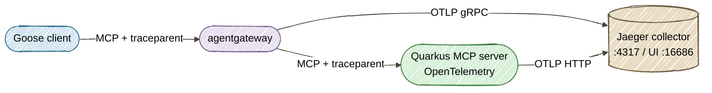

# Part 3: End-to-End Tracing and Observability Across Goose, agentgateway, and Quarkus

**Long-form guide:** [Part 3 tutorial](../docs/tutorials/03-observability.md)

This directory contains the companion demo for Part 3 of the series. It adds distributed tracing across all three layers — Goose (client), agentgateway (proxy), and Quarkus (backend) — using W3C Trace Context propagation and Jaeger.

## Architecture



## Prerequisites

- Everything from Parts 1 and 2 (Java 25+, Maven 3.9+, Goose CLI, agentgateway)
- **Podman** with Podman Compose

## Quick Start

```bash
cd part3-observability
./start-all.sh
```

This starts Jaeger, Quarkus (with OpenTelemetry enabled), and agentgateway (with trace export), then generates sample traces automatically.

Open **Jaeger UI** at [http://localhost:16686](http://localhost:16686) to view trace waterfalls.

### With guardrails

```bash
./start-all.sh agentgateway/config-traced-guardrails.yaml
```

This additionally starts the ExtMCP guardrail server from Part 2 on `:9001` and includes guardrail evaluation spans in traces.

## Generate Traces Manually

```bash
# Initialize MCP session
export MCP_SESSION_ID=$(curl -s -D - http://localhost:3000/mcp \
  -H "Content-Type: application/json" \
  -H "Accept: application/json, text/event-stream" \
  -H "MCP-Protocol-Version: 2025-03-26" \
  -d '{"jsonrpc":"2.0","id":1,"method":"initialize","params":{"protocolVersion":"2025-03-26","capabilities":{},"clientInfo":{"name":"curl","version":"1.0"}}}' \
  | grep -i "mcp-session-id:" | sed 's/.*: //' | tr -d '\r')

# Call a tool — this produces a trace in Jaeger
curl -s http://localhost:3000/mcp \
  -H "Content-Type: application/json" \
  -H "Accept: application/json, text/event-stream" \
  -H "MCP-Protocol-Version: 2025-03-26" \
  -H "mcp-session-id: $MCP_SESSION_ID" \
  -d '{"jsonrpc":"2.0","id":2,"method":"tools/call","params":{"name":"getCustomerStatus","arguments":{"customerId":"CUST-4091"}}}' \
  | grep '^data: ' | sed 's/^data: //' | jq .
```

Then open [http://localhost:16686](http://localhost:16686), select service `customer-tools`, and click **Find Traces**.

## Configuration Files

| File | Purpose |
|------|---------|
| `compose.yml` | Jaeger v2 with OTLP collection on :4317 (Podman Compose compatible) |
| `agentgateway/config-traced.yaml` | Proxy + tracing — OTLP export, no security layers |
| `agentgateway/config-traced-guardrails.yaml` | Proxy + tracing + ExtMCP guardrails |
| `start-all.sh` | Launches Jaeger, Quarkus, agentgateway, and generates sample traces |

## Viewing Traces in Jaeger

1. Open [http://localhost:16686](http://localhost:16686)
2. Select **Service**: `customer-tools` (Quarkus) or `agentgateway`
3. Click **Find Traces**
4. Click any trace to see the waterfall

A typical `tools/call` waterfall:

```
agentgateway.mcp.proxy                         [12ms]
  └─ POST /mcp                                 [8ms]   ← Quarkus
       └─ CustomerServiceTools.getCustomerStatus [2ms]  ← Tool execution
```

## Cleanup

```bash
# Stop all services (Ctrl+C in the start-all.sh terminal)
# Then remove the Jaeger container:
podman compose down
```
