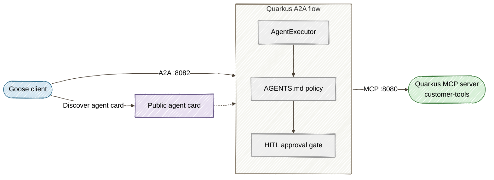
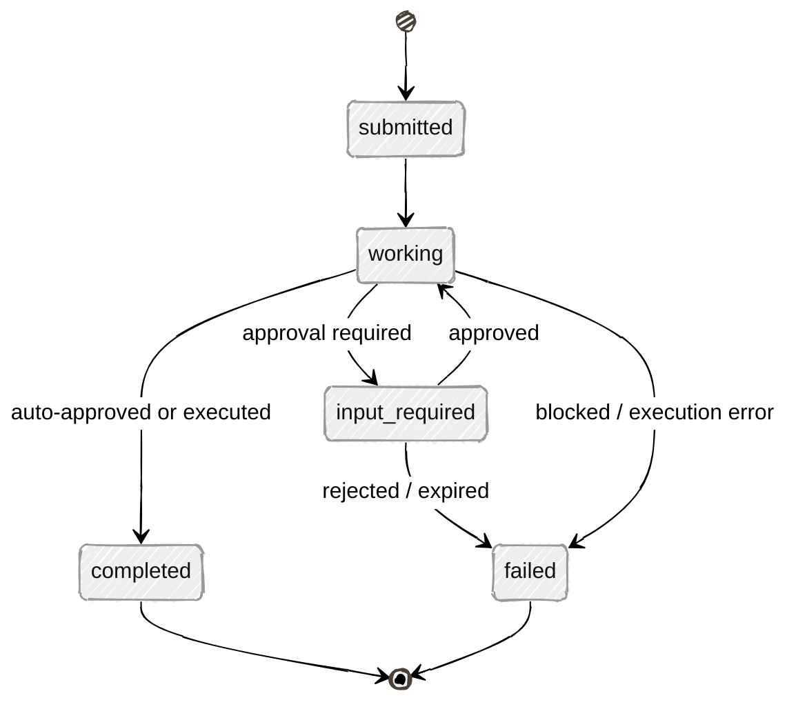

# Part 4: Multi-Agent Orchestration with A2A Protocol

**Long-form guide:** [Part 4 tutorial](../docs/tutorials/04-multi-agent-governance.md)

This directory contains the companion demo for Part 4 of the series. It bridges Goose agent interactions with Quarkus Flow state machines governed by AGENTS.md rules and integrated via the Agent2Agent (A2A) protocol — the Linux Foundation standard for multi-agent interoperability.

## Architecture



### A2A Task Lifecycle



## Prerequisites

- Everything from Part 1 (Java 25+, Maven 3.9+)

## Quick Start

```bash
cd part4-multi-agent
./start-all.sh
```

This builds Part 1's MCP server and Part 4's A2A Flow server, starts both, and generates sample tasks automatically:

| Task | Operation | Outcome |
|------|-----------|---------|
| `demo-task-1` | `analyze-logs` | Auto-approved, delegates to Part 1 MCP tools |
| `demo-task-2` | `migrate-schema` | Paused at `input-required` (HITL gate) |
| `demo-task-3` | `drop-database` | Blocked by AGENTS.md governance |

Open the **A2A Console SPA** at [http://localhost:8889/index.html](http://localhost:8889/index.html) to approve or reject `demo-task-2`.

## Manual A2A Examples

### Discover the agent

```bash
curl -s http://localhost:8082/.well-known/agent-card.json | jq .
```

### Submit a task (auto-approved)

```bash
curl -s http://localhost:8082/ \
  -H "Content-Type: application/json" \
  -H "A2A-Version: 1.0" \
  -d '{"jsonrpc":"2.0","id":1,"method":"SendMessage","params":{
    "message":{"messageId":"my-msg-1","role":"ROLE_USER","parts":[{"text":"health-check --service api-gateway"}]}
  }}' | jq .
```

### Submit a task (HITL required)

```bash
curl -s http://localhost:8082/ \
  -H "Content-Type: application/json" \
  -H "A2A-Version: 1.0" \
  -d '{"jsonrpc":"2.0","id":2,"method":"SendMessage","params":{
    "message":{"messageId":"my-msg-2","role":"ROLE_USER","parts":[{"text":"process-refund --customer CUST-4091 --amount 2500"}]},
    "configuration":{"returnImmediately":true}
  }}' | jq .
```

### Poll task status

```bash
curl -s http://localhost:8082/ \
  -H "Content-Type: application/json" \
  -H "A2A-Version: 1.0" \
  -d '{"jsonrpc":"2.0","id":3,"method":"GetTask","params":{"id":"<task-id-from-above>"}}' | jq .
```

### Approve a pending task (via admin API)

```bash
curl -s -X POST http://localhost:8082/api/tasks/my-task-2/approve | jq .
```

## Configuration Files

| File | Purpose |
|------|---------|
| `src/main/resources/application.properties` | Quarkus HTTP port (8082), CORS, MCP server URL |
| `src/main/resources/AGENTS.md` | Governance rules: auto-approved, HITL-required, and blocked operations |
| `start-all.sh` | Builds Part 1 + Part 4, launches both servers, starts the SPA, generates sample tasks |

## Cleanup

```bash
# Stop all services (Ctrl+C in the start-all.sh terminal)
```
