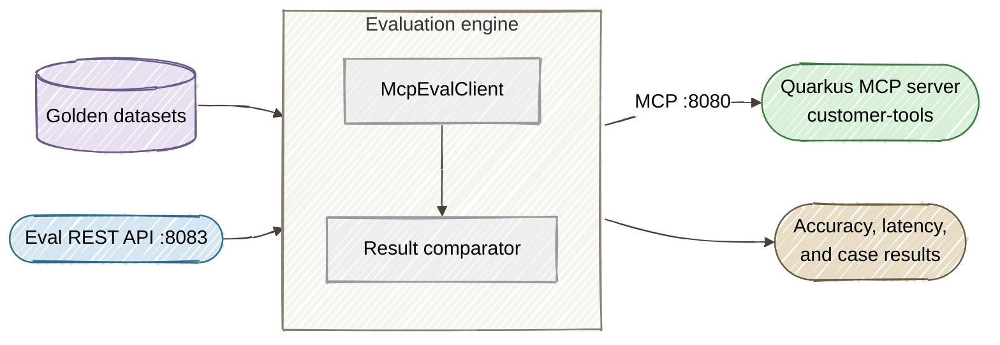

# Part 5: Automated Agent Evaluation and Regression Testing

**Long-form guide:** [Part 5 tutorial](../docs/tutorials/05-evaluation.md)

This directory contains the companion demo for Part 5 of the series. It provides an automated evaluation framework that uses golden datasets to verify MCP tool accuracy, Bean Validation boundaries, and multi-step agent workflows — all runnable from CI/CD.

## Architecture



## Prerequisites

- Everything from Part 1 (Java 25+, Maven 3.9+)

## Quick Start

```bash
cd part5-evaluation
./start-all.sh
```

This builds Part 1's MCP server and Part 5's eval runner, starts both, and runs all three golden suites automatically:

| Suite | What It Tests | Cases |
|-------|--------------|-------|
| `tool-accuracy` | Correct output for all 5 MCP tools with known inputs | 12 |
| `validation-boundary` | Bean Validation rejects SQL injection, XSS, format violations | 8 |
| `workflow-regression` | Multi-step agent workflows with variable chaining | 3 workflows (8 steps) |

Open the **Evaluation Console SPA** at [http://localhost:8891/index.html](http://localhost:8891/index.html) to run evaluations interactively.

## REST API Examples

### List available suites

```bash
curl -s http://localhost:8083/eval/suites | jq .
```

### Run a specific suite

```bash
curl -s -X POST http://localhost:8083/eval/run/tool-accuracy | jq .
```

### Run all suites and check accuracy

```bash
for suite in tool-accuracy validation-boundary workflow-regression; do
  echo "Running $suite..."
  curl -s -X POST http://localhost:8083/eval/run/$suite | \
    python3 -c "import sys,json; r=json.loads(sys.stdin.read()); print(f'  {r[\"passed\"]}/{r[\"total\"]} passed ({r[\"accuracy\"]:.1f}%)')"
done
```

## Golden Dataset Format

Each golden dataset is a JSON file in `golden/` with test cases:

```json
{
  "name": "tool-accuracy",
  "description": "Verify correct output for each MCP tool",
  "cases": [
    {
      "id": "customer-active-enterprise",
      "tool": "getCustomerStatus",
      "arguments": {"customerId": "CUST-4091"},
      "expect": {"status": "ACTIVE", "tier": "ENTERPRISE_TIER"}
    }
  ]
}
```

| Assertion | Field | Purpose |
|-----------|-------|---------|
| Exact match | `expect` | Verify specific field values in tool output |
| Count | `expectCount` | Verify array length (e.g., 6 health log entries) |
| Error | `expectError` + `errorContains` | Verify validation rejects input with correct message |
| Workflow chaining | `extractField` / `extractAs` | Pass output from one step as input to the next |

## Configuration Files

| File | Purpose |
|------|---------|
| `src/main/resources/application.properties` | Eval runner HTTP port (8083), MCP endpoint URL, CORS |
| `golden/tool-accuracy.json` | Tool output accuracy test cases |
| `golden/validation-boundary.json` | Bean Validation boundary test cases |
| `golden/workflow-regression.json` | Multi-step workflow regression tests |
| `start-all.sh` | Builds Part 1 + Part 5, launches both servers, starts the SPA, runs quick eval |

## Cleanup

```bash
# Stop all services (Ctrl+C in the start-all.sh terminal)
```
