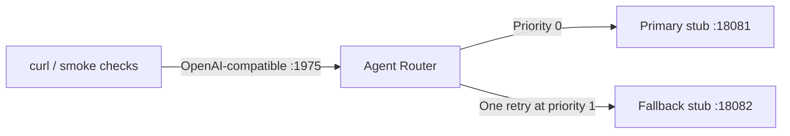

# Part 6: Model Routing and Failover with Agent Router

**Long-form guide:** [Part 6 tutorial](../docs/tutorials/06-model-routing.md)

Optional 30-minute capstone: run Agent Router **v1.1.0** against two deterministic local model
stubs. Exercise routing, fallback, non-retryable errors, and recovery without API keys or a GPU.
The actual Agent Router/Envoy runtime performs the routing. The stubs do not perform inference.

## Architecture



The existing Goose → agentgateway → Quarkus MCP path is independent. Parts 1–5 do not need to
be running, and this directory is not a Maven module.

## Prerequisites

- Python 3.10+, Bash, curl.
- macOS Apple Silicon or Linux x86_64/ARM64. For Intel Macs or Windows, use a supported Linux
  environment; the pinned release has no native binary for those platforms.
- Network access for the initial CLI and Envoy downloads; cached lab runs require no provider access.
- Free ports 1975 (model API), 1064 (gateway health), 18081/18082 (stub APIs). Envoy also uses
  internal listener ports; inspect the log if one conflicts.

## Quick Start

```bash
# From the repository root
cd part6-agent-router
./install.sh
./start-all.sh
```

Installation checks release SHA-256 digests and writes `.bin/aigw`. The first launch downloads
Envoy **1.38.1**. Prepare these downloads before a timed workshop. Use a trusted local machine:
the gateway listener has no authentication; stub control endpoints bind to loopback.

In a second terminal:

```bash
cd part6-agent-router
curl -sS http://localhost:1975/v1/chat/completions \
  -H 'Content-Type: application/json' \
  -d '{"model":"acme-support","stream":false,"messages":[{"role":"user","content":"Summarize Acme support status."}]}'
python3 smoke.py
```

Expect `primary:` in the completion and `6/6 routing checks passed`. Ctrl+C in the launcher
stops only the services it started. Existing MCP labs and Goose configuration are untouched.

## Trigger a Failure

```bash
curl -sS http://localhost:18081/admin -H 'Content-Type: application/json' \
  -d '{"mode":"unavailable","reset":true}'
# Repeat the model request: expect HTTP 200 and content beginning "fallback:".
curl -sS http://localhost:18081/admin
curl -sS http://localhost:18082/admin
```

Both stubs support `healthy`, `unavailable` (503), and `bad-request` (400) via `POST /admin`.
`reset:true` clears the counter and last model. A GET reads state without counting an attempt.
Restarting clears all stub state. The stub intentionally rejects streaming requests.

## Configuration Files

| File | Purpose |
|---|---|
| `config.yaml` | Route `acme-support` to primary/fallback with the common upstream model `acme-model-v1` |
| `lab.py` | Local stubs, readiness checks, gateway supervision, and process-group cleanup |
| `smoke.py` | Actual HTTP routing checks, including attempt counts and recovery |
| `install.sh` | Platform-aware, checksum-verified installation of v1.1.0 |
| `start-all.sh` | Launcher; accepts `--config /path/to/config.yaml` or `--smoke` |
| `.runtime/gateway.log` | Ignored diagnostic output from the most recent run |

Stop and restart after editing `config.yaml`. The tutorial changes the matched model name
temporarily, then restores `acme-support` before verification. The smoke checks require that
original routing contract.

## Automated Verification

```bash
# With no lab already running: start, verify, and stop, propagating a failing exit code.
./start-all.sh --smoke
```

The checks cover healthy primary, unmatched model, 503 fallback, non-retryable 400, both
backends unavailable, and recovery. They assert exact backend attempt counts and upstream
model names. They modify stub modes and reset counters; run without concurrent lab clients.
They do not evaluate generated answers or the existing MCP/A2A controls.

## Troubleshooting

| Symptom | Action |
|---|---|
| Missing binary | Run `./install.sh`; alternatively set `AIGW_BIN` to an absolute v1.1.0 executable path |
| Checksum mismatch | Do not run the downloaded asset; confirm the pinned release and retry the installer |
| Port unavailable | Stop the owning process yourself; the launcher never kills a process to claim a port |
| Startup fails or times out | Inspect `.runtime/gateway.log`; check the initial Envoy download, runtime port conflicts, and YAML |
| 404 for `acme-support` | Restore the route match in `config.yaml` and restart |
| Unexpected fallback or 400/503 | Reset both stubs to `healthy`, or restart the lab |
| Smoke attempt-count mismatch | Stop other clients; restore the checked-in policy and run again |

The launcher uses an isolated short `/tmp` directory for Unix sockets and removes it on exit.
Persistent binaries/logs stay in `.bin/` and `.runtime/`. It checks the CLI version, imposes a
startup timeout, and terminates its own process group on exit. It never edits global provider
configuration or runs cleanup against processes belonging to Parts 1–5.

## Optional Extensions

The [tutorial](../docs/tutorials/06-model-routing.md#optional-follow-up-exercises) outlines
Goose with real inference (15–20 minutes), Jaeger tracing (10–15 minutes), and token quotas
(20–30 minutes). These require separate configuration and are outside the core 30-minute lab.
