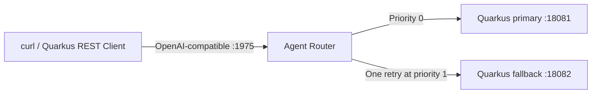

# Part 6: Model Routing and Failover with Agent Router and Quarkus

**Long-form guide:** [Part 6 tutorial](../docs/tutorials/06-model-routing.md)

30-minute lab: run Agent Router **v1.1.0** against two instances of a Quarkus model simulator.
Exercise routing, fallback, non-retryable errors, and recovery without API keys or a GPU.
Agent Router/Envoy performs the routing; the Quarkus backends return deterministic completions.
They do not perform inference. All application, launcher, and verification logic is Java.

## Architecture



The existing Goose → agentgateway → Quarkus MCP path is independent. Parts 1–5 do not need to
be running. Part 6 is a Maven module included in the root build.

## Prerequisites

- Java 25+, Maven 3.9+, Bash, curl, and `sha256sum` (Linux) or `shasum` (macOS).
- macOS Apple Silicon or Linux x86_64/ARM64 for the pinned Agent Router binary. For Intel Macs
  or Windows, use a supported Linux environment.
- Network access for initial Maven dependencies, CLI, and Envoy downloads; cached runs need
  no provider access. Prepare these downloads before a timed workshop.
- Free ports 1975 (model API), 1064 (gateway health), 18081/18082 (Quarkus backends). Envoy also
  uses internal listener ports; inspect the log if one conflicts.

Python is not required for this lab. The documentation site still has its own Python tooling.

## Quick Start

```bash
# From the repository root
cd part6-agent-router
./install.sh
mvn package -DskipTests
./start-all.sh
```

Installation checks release SHA-256 digests and writes `.bin/aigw`. The first launch downloads
Envoy **1.38.1**. `start-all.sh` builds the app before launching; set `SKIP_BUILD=true` to reuse
an existing build. The gateway listener is unauthenticated, so use a trusted local machine;
Quarkus backend and control endpoints bind to loopback.

In a second terminal at `part6-agent-router/`:

```bash
curl -sS http://localhost:1975/v1/chat/completions \
  -H 'Content-Type: application/json' \
  -d '{"model":"acme-support","stream":false,"messages":[{"role":"user","content":"Summarize Acme support status."}]}'
./smoke.sh
```

Expect `primary:` in the completion and `6/6 routing checks passed`. Ctrl+C in the launcher
stops only its owned processes. Existing MCP labs and Goose configuration are independent.

## Quarkus Application

One packaged application serves three roles:

| Role | Command or configuration | Responsibility |
|---|---|---|
| Backend | `serve`; default when no command is supplied | REST completion and failure-control endpoints |
| Launcher | `run`, using the `cli` profile via `start-all.sh` | Start two backends and Agent Router, wait for readiness, clean up owned processes |
| Verifier | `smoke`, using the `cli` profile via `smoke.sh` | Run six real HTTP routing checks with Quarkus REST Client |

The launcher starts the same JAR with `-Dquarkus.http.port=18081 -Dmodel.backend-name=primary`
and `-Dquarkus.http.port=18082 -Dmodel.backend-name=fallback`. Each process has isolated CDI
state. The `cli` profile disables the launcher's and verifier's HTTP listeners.

| Endpoint on each backend | Purpose |
|---|---|
| `POST /v1/chat/completions` | Fixed OpenAI-shaped JSON response; Bean Validation checks model, messages, and non-streaming input |
| `GET /admin` | Read backend name, mode, attempt counter, and last upstream model |
| `POST /admin` | Set `healthy`, `unavailable` (503), or `bad-request` (400); optionally reset counters |
| `GET /q/health/ready` | SmallRye Health readiness; remains UP during deliberately simulated provider errors |

`ModelResource` handles HTTP, `ModelService` holds synchronized in-memory state, and `ModelApi`
defines Java record contracts. `RoutingChecks` uses typed REST clients to reach the actual
Agent Router and control both backends. The launcher uses Java process APIs to supervise its
children and retain handles to their descendants for cleanup.

## Trigger a Failure

```bash
curl -sS http://localhost:18081/admin -H 'Content-Type: application/json' \
  -d '{"mode":"unavailable","reset":true}'
# Repeat the model request: expect HTTP 200 and content beginning "fallback:".
curl -sS -w '\n' http://localhost:18081/admin
curl -sS -w '\n' http://localhost:18082/admin
```

`reset:true` clears the counter and last model. A GET reads state without counting an attempt.
Restarting clears all backend state. Streaming requests, missing/empty model or message fields,
and unsupported control modes return 400 before changing state. Bodies above 64 KiB return 413.

## Configuration Files

| File | Purpose |
|---|---|
| `config.yaml` | Route `acme-support` to primary/fallback with common upstream model `acme-model-v1` |
| `pom.xml` | Quarkus REST/Jackson, REST Client/Jackson, Bean Validation, SmallRye Health, and endpoint tests |
| `src/main/resources/application.properties` | Ports, backend identity, CLI profile, client timeouts |
| `src/main/java/com/example/router/` | Java API, backend state, launcher, and verifier |
| `src/test/java/com/example/router/` | Quarkus REST contract tests |
| `install.sh` | Platform-aware, checksum-verified installation of v1.1.0 |
| `start-all.sh` | Build and launch; accepts `--config /path/to/config.yaml` or `--smoke` |
| `smoke.sh` | Run the packaged Quarkus verifier against an already running lab |
| `.runtime/*.log` | Ignored gateway, primary, and fallback logs from the most recent launch |

Stop and restart after editing `config.yaml`. The tutorial changes the matched model name
then restores `acme-support` before verification. Smoke checks require that original contract.

## Automated Verification

```bash
# Quarkus REST contract tests; Agent Router need not be installed or running.
mvn test

# With no lab already running: build, start, verify, and stop.
./start-all.sh --smoke

# If the packaged app is already current:
SKIP_BUILD=true ./start-all.sh --smoke
```

Endpoint tests cover completion format, state transitions, malformed/invalid input, body-size
limits, and readiness. The six routing checks cover healthy primary, unmatched model, 503
fallback, non-retryable 400, both backends unavailable, and recovery. They assert exact backend
attempt counts and upstream model names. Run without concurrent clients because the verifier
changes modes and resets counters. Neither test layer evaluates generated answer quality.

## Troubleshooting

| Symptom | Action |
|---|---|
| Missing CLI | Run `./install.sh`, or set `AIGW_BIN` to an absolute v1.1.0 executable path |
| Missing application JAR | Run `./start-all.sh` without `SKIP_BUILD=true` |
| Checksum mismatch | Do not run the downloaded asset; confirm the pinned release and retry |
| Port unavailable | Stop the owning process yourself; the launcher never kills a process to claim a port |
| Backend startup fails | Inspect `.runtime/primary.log` or `.runtime/fallback.log`; verify Java 25+ |
| Gateway startup fails/times out | Inspect `.runtime/gateway.log`; check the initial Envoy download, ports, and YAML |
| 404 for `acme-support` | Restore the route match in `config.yaml` and restart |
| Unexpected fallback or 400/503 | Reset both backends to `healthy`, or restart |
| Attempt-count mismatch | Stop other clients, restore the checked-in policy, and run again |

The launcher uses a short, isolated `/tmp` directory for Unix sockets and removes it on exit.
Persistent binaries and logs stay in `.bin/` and `.runtime/`. Startup waits are bounded, and
cleanup targets only owned process handles. It never edits global provider configuration.

## Optional Extensions

The [tutorial](../docs/tutorials/06-model-routing.md#optional-follow-up-exercises) outlines
Goose with real inference (15–20 minutes), Jaeger tracing (10–15 minutes), and token quotas
(20–30 minutes). These remain outside the core 30-minute lab.

Quarkus references: [REST and JSON](https://quarkus.io/guides/rest-json),
[REST Client](https://quarkus.io/guides/rest-client), [validation](https://quarkus.io/guides/validation),
[health](https://quarkus.io/guides/smallrye-health), and
[command mode](https://quarkus.io/guides/command-mode-reference).
